# AgenticWorkflow: Architecture and Philosophy

이 문서는 AgenticWorkflow 프로젝트의 **설계 철학**과 **아키텍처 전체 조감도**를 기술한다.
"무엇이 있는가"(CLAUDE.md, AGENTS.md)와 "어떻게 쓰는가"(USER-MANUAL)를 넘어, **"왜 이렇게 설계했는가"**를 체계적으로 서술하는 문서이다.

---

## 1. 설계 철학 (Design Philosophy)

### 1.1 핵심 신념: 워크플로우 설계는 중간물이다

이 프로젝트의 근본적 신념은 하나로 요약된다:

> **워크플로우 문서(`workflow.md`)는 설계도이고, 최종 산출물은 그 설계도대로 작동하는 실제 시스템이다.**

```
                  ┌─────────────────────────┐
                  │    Phase 1: 설계         │
                  │  "workflow.md 생성"       │
                  │  ── 중간 산출물 ──         │
                  └────────────┬────────────┘
                               │
                               ▼
                  ┌─────────────────────────┐
                  │    Phase 2: 구현         │
                  │  "실제 동작하는 시스템"    │
                  │  ── 최종 산출물 ──         │
                  └─────────────────────────┘
```

많은 자동화 프로젝트가 "계획을 세우는 것"에서 멈춘다. AgenticWorkflow는 이 함정을 명시적으로 경계한다. Phase 1의 `workflow.md`는 그 자체로 가치 있는 설계 문서이지만, **Phase 2에서 에이전트·스크립트·자동화가 실제로 동작하지 않으면 미완성**이다.

이 신념이 프로젝트의 모든 설계 결정을 관통한다:
- Skill이 단순한 프롬프트 모음이 아닌 **실행 가능한 구현 패턴**까지 포함하는 이유
- Workflow 템플릿에 Claude Code Configuration 섹션이 의무적으로 포함되는 이유
- 구현 요소(Sub-agent, Hook, MCP)에 대한 구체적 설정 예시가 참조 문서에 있는 이유

### 1.2 품질 절대주의

AgenticWorkflow의 모든 의사결정은 **하나의 기준**으로 수렴한다:

> 속도, 토큰 비용, 작업량, 분량 제한은 완전히 무시한다.
> 모든 의사결정의 유일한 기준은 **최종 결과물의 품질**이다.

이것은 슬로건이 아니다. 구체적인 설계 행동 규칙이다:

| 상황 | 일반적 선택 | AgenticWorkflow의 선택 | 근거 |
|------|-----------|---------------------|------|
| 워크플로우 단계 수 | 줄여서 효율적으로 | 늘려서라도 품질을 높이는 방향 | 절대 기준 1 |
| 에이전트 수 | 비용 절감을 위해 최소화 | 품질이 올라가면 추가 | 절대 기준 1 |
| 검증 반복 | 1회 패스로 확정 | 결과물이 나아지면 반복 허용 | 절대 기준 1 |
| Sub-agent vs Agent Team | 속도가 빠른 쪽 | 최종 품질이 높은 쪽 | 에이전트 선택 유일 기준 |

이 원칙은 두 스킬에서도 도메인에 맞게 반복된다:
- **workflow-generator**: "빠른 워크플로우보다 정확한 워크플로우"
- **doctoral-writing**: "수정 횟수보다 학술적 엄밀성"

### 1.3 이론적 기반: Recursive Language Models과의 연결

`coding-resource/recursive language models.pdf`는 MIT CSAIL의 2025년 연구로, 이 프로젝트의 **에이전트 아키텍처 설계 배경**을 제공한다.

**RLM의 핵심 패러다임:**

```
전통적 LLM:  입력 → [신경망 처리] → 출력
                    (컨텍스트 윈도우 제한)

RLM:         입력 → [Python REPL 환경] → LLM이 코드를 작성하여 입력을 탐색
                    (무제한 컨텍스트, 재귀적 분해)
```

**AgenticWorkflow와의 구조적 대응:**

| RLM 개념 | AgenticWorkflow 대응 | 설계 근거 |
|---------|---------------------|----------|
| Python REPL 환경 | SOT 파일 (state.yaml) | 외부 상태를 프로그래밍적으로 관리 |
| 재귀적 Sub-call | Sub-agent 위임 | 복잡한 작업을 전문가에게 분해 위임 |
| Code-based Filtering | Pre/Post-processing Scripts | 신경망 투입 전 결정론적 데이터 정제 |
| Variable Persistence | 산출물 파일 (output-*.md) | 중간 결과를 외부 환경에 영속 저장 |
| Answer Verification | Hook 기반 품질 게이트 | 자동화된 검증 단계 |
| Structured Metadata | Knowledge Archive 메타데이터 (phase, phase_flow, primary_language) | 세션 간 구조화된 인덱싱 |

RLM 논문의 핵심 발견 — **"프롬프트를 신경망에 직접 넣지 말고, 외부 환경의 객체로 취급하라"** — 이 원칙이 AgenticWorkflow의 설계 원칙 P1(데이터 정제)과 절대 기준 2(SOT)의 이론적 뿌리다.

특히 RLM의 **P8 상응성**이 주목할 만하다: RLM은 Python 코드(결정론적)를 측정의 backbone으로 사용하고, LLM(확률론적)은 추론의 보조로 사용한다. 이는 AgenticWorkflow에서 Python 스크립트로 전처리/후처리를 수행하고, AI 에이전트는 판단·분석·창의적 생성에만 집중하는 구조와 정확히 일치한다.

### 1.4 유전 설계 철학 (Heredity Design Philosophy)

AgenticWorkflow의 존재 이유는 §1.1의 신념을 확장한다: 이 코드베이스는 완결된 시스템이 아니라, **또 다른 agentic workflow automation system을 낳는 부모 유기체**다.

> 줄기세포의 분화에서 가장 중요한 사실 — **분화된 모든 세포는 부모의 전체 게놈을 그대로 갖고 있다.**
> 근육 세포와 신경 세포는 하는 일이 전혀 다르지만, 둘 다 똑같은 DNA를 갖고 있다.
> 발현되는 유전자가 다를 뿐, 게놈 자체는 동일하다.

**게놈 구성요소 → 자식에 내장되는 형태:**

| 부모 게놈 (DNA) | 자식 워크플로우에 내장되는 형태 | 발현 차이 예시 |
|---------------|---------------------------|-------------|
| 절대 기준 3개 | `Inherited DNA` 섹션 — 도메인별 맥락화 | SW 개발: CCP 강발현 / 콘텐츠: 품질 절대주의 강발현 |
| SOT 패턴 | `state.yaml` + 단일 쓰기 지점 | 모든 도메인에서 동일 발현 |
| 3단계 구조 | Research → Planning → Implementation | 연구 자동화: Research 강발현 |
| 4계층 검증 | L0 → L1 → L1.5 → L2 | 고위험 도메인: L2 강발현 |
| P1 봉쇄 | Python 결정론적 검증 | 데이터 파이프라인: P1 강발현 |
| Safety Hook | 위험 명령 차단 | 인프라 자동화: Safety 강발현 |
| Adversarial Review | Generator-Critic 패턴 | 연구/출판: Review 강발현 |
| Decision Log | 자동 승인 결정 기록 | 모든 도메인에서 동일 발현 |
| Context Preservation | 세션 간 기억 보존 | 장기 프로젝트: 강발현 |

**구조적 유전 vs 단순 참조:**

유전은 "참조"와 근본적으로 다르다. 참조는 "이 원칙을 적용할까 말까"를 선택할 수 있지만, 유전은 태어날 때부터 원칙으로 **구성되어** 있다. `workflow-generator`가 자식을 낳을 때 `Inherited DNA` 섹션을 workflow.md에 구조적으로 포함하는 것이 이 차이의 구현이다.

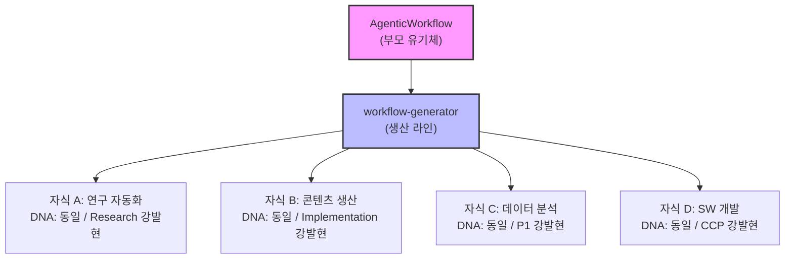

**RLM과의 연결:** RLM의 **Variable Persistence** — 중간 결과를 외부 환경에 영속 저장하는 패턴 — 는 유전의 이론적 기반이다. 부모의 게놈은 `soul.md`, `AGENTS.md`, `workflow-template.md`에 외부 객체로 영속 저장되어 있으며, `workflow-generator`가 이 객체를 읽어 자식의 구조에 주입한다. 유전 정보가 프롬프트(신경망 내부)가 아닌 파일(외부 환경)에 존재하기 때문에, 세션이 바뀌어도 게놈은 보존된다.

상세: `soul.md §0`.

---

## 2. 절대 기준 체계 (Absolute Criteria System)

절대 기준은 이 프로젝트의 **헌법**이다. 모든 설계 원칙, 가이드라인, 관례보다 상위에 있으며, 어떤 원칙이든 절대 기준과 충돌하면 절대 기준이 이긴다.

### 2.1 절대 기준 1: 최종 결과물의 품질

- 속도, 토큰 비용, 작업량, 분량 제한은 **완전히 무시**
- 유일한 의사결정 기준은 **최종 결과물의 품질**
- 단계를 줄여서 빠르게 만드는 것보다, 단계를 늘려서라도 품질을 높이는 방향을 선택

### 2.2 절대 기준 2: 단일 파일 SOT + 계층적 메모리 구조

- 모든 공유 상태는 **단일 파일**에 집중 (분산 금지)
- **쓰기 권한**: Orchestrator 또는 Team Lead만 보유
- **다른 에이전트**: 읽기 전용 + 산출물 파일 생성
- **충돌 방지**: 복수 에이전트가 동일 파일을 동시 수정하는 구조 설계 금지

### 2.3 절대 기준 3: 코드 변경 프로토콜 (Code Change Protocol)

- 코드를 작성·수정·추가·삭제하기 전에, **반드시 3단계를 내부적으로 수행**
- **Step 1 — 의도 파악**: 변경 목적과 제약을 1-2문장으로 정의
- **Step 2 — 영향 범위 분석**: 직접 의존, 호출 관계, 구조적 관계, 데이터 모델, 테스트, 설정, 문서의 연쇄 변경을 전문가 수준에서 조사. 강결합·샷건 서저리 위험 시 사전 고지 필수
- **Step 3 — 변경 설계**: 단계별 변경 순서 제안 (파일/함수 → 의존성 전파 → 테스트/문서 정합). 결합도 감소 기회 함께 제안

**비례성 규칙:**

| 변경 규모 | 적용 깊이 |
|----------|---------|
| 경미 (오타, 주석) | Step 1만 |
| 표준 (함수/로직 변경) | 전체 3단계 |
| 대규모 (아키텍처, API) | 전체 3단계 + 사전 사용자 승인 필수 |

절대 기준 1(품질)이 "무엇을 최적화하는가"를, 절대 기준 2(SOT)가 "데이터를 어떻게 구조화하는가"를 정의한다면, 절대 기준 3은 **"코드를 변경할 때 어떻게 행동하는가"**를 정의한다. 품질 높은 코드는 의존성·결합도·변경 파급 효과를 사전에 분석하는 엄밀한 프로세스에서 나온다.

> **상세 프로토콜**(전체 분석 항목, 적용 예시, 커뮤니케이션 규칙)은 **AGENTS.md §2 절대 기준 3**에 정의되어 있다.
> All CCP steps are performed with **Coding Anchor Points (CAP-1~4)** — Think before coding, Simplicity first, Goal-driven execution, Surgical changes — internalized.

### 2.4 우선순위 해결: 품질 > SOT, CCP

절대 기준 1(품질)이 최상위이다. 절대 기준 2(SOT)와 절대 기준 3(CCP)은 품질을 보장하기 위한 **동위 수단**이다. 어느 기준이든 절대 기준 1과 충돌하면 품질이 이긴다.

```
절대 기준 1 (품질) — 최상위. 모든 기준의 존재 이유.
  ├── 절대 기준 2 (SOT) — 데이터 무결성 보장 수단
  └── 절대 기준 3 (CCP) — 코드 변경 품질 보장 수단
```

절대 기준 2와 3은 서로 다른 차원에서 작동하므로 직접 충돌 가능성은 낮다:
- **절대 기준 2**: 워크플로우 실행 시 데이터 아키텍처 (누가 어디에 쓰는가)
- **절대 기준 3**: 코드 개발 시 변경 프로세스 (어떻게 분석하고 변경하는가)

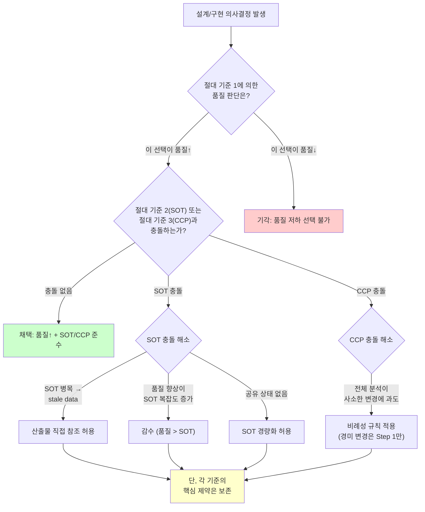

**구체적 충돌 시나리오:**

| 시나리오 | 충돌 기준 | 해소 방법 | 보존하는 것 |
|---------|----------|----------|------------|
| Team Lead가 유일한 SOT 쓰기 지점이라 팀원이 stale data로 작업 | 1 vs 2 | 팀원 간 산출물 파일 직접 참조 허용 | SOT 파일 자체의 단일 쓰기 지점 |
| 품질 향상을 위한 단계 추가가 SOT 상태 복잡도를 증가시킴 | 1 vs 2 | 복잡도 증가를 감수 | 절대 기준 1 우선 원칙 |
| 완전 독립 병렬 작업에서 SOT가 불필요 | 1 vs 2 | SOT 경량화 허용 | 판단 근거를 워크플로우에 명시 |
| CCP 전체 분석이 경미한 변경에 과도한 오버헤드 발생 | 1 vs 3 | 비례성 규칙 적용 (Step 1만) | 프로토콜 자체는 건너뛰지 않음 |

### 2.5 절대 기준의 스킬별 맥락화

절대 기준은 그 자체로는 추상적이다. 실제 힘을 발휘하려면 **각 스킬의 도메인에 맞게 맥락화**되어야 한다:

| 절대 기준 | workflow-generator | doctoral-writing |
|---------|-------------------|-----------------|
| **1. 품질** | 빠른 워크플로우보다 정확한 워크플로우. 단계가 많아져도 품질↑이면 추가 | 수정 횟수·작업량 무시. 학술적 엄밀성·명료성·논리적 깊이가 유일한 기준 |
| **2. SOT** | workflow.md가 설계와 상태관리의 단일 정의 지점 | 용어·논증·인용·스타일의 일관성을 원고 전체에서 유지 (용어 SOT, 인용 SOT) |
| **3. CCP** | 워크플로우 코드 구현 시 의존성·파급 효과 분석 필수. 구성요소(에이전트, Hook, SOT) 간 결합도 관리 | N/A — 코드 변경이 아닌 텍스트 편집 도메인. 단, 이 스킬 자체의 코드를 수정할 때는 적용 |
| **우선순위 충돌** | SOT 구조가 품질 병목이면 조정 가능. CCP 분석이 과도하면 비례성 규칙 적용 | 일관성이 정확성을 해치면 정확성 우선 → 소급 일관성 업데이트 |

이 맥락화가 스킬 개발 규칙의 첫 번째 항목("모든 절대 기준을 반드시 포함 — 해당 도메인에 맞게 맥락화")이 존재하는 이유이다. 코드 변경이 아닌 도메인의 스킬에서는 절대 기준 3(CCP)의 맥락화가 N/A일 수 있다.

---

## 3. 아키텍처 전체 조감도 (Architecture Overview)

### 3.1 시스템 전체 아키텍처

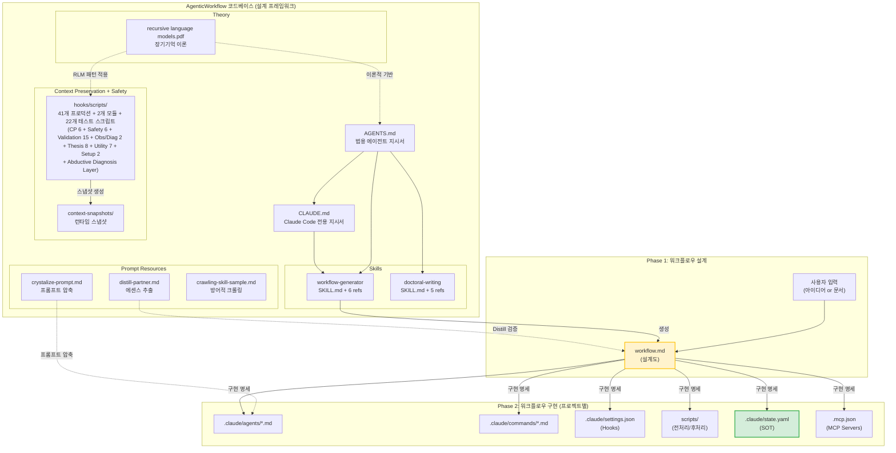

### 3.2 두 단계 프로세스의 입출력 흐름

| 단계 | 입력 | 도구 | 산출물 | 성격 |
|------|------|------|--------|------|
| **Phase 1** | 사용자 아이디어 또는 설명 문서 | workflow-generator 스킬 | `workflow.md` | 중간 산출물 (설계도) |
| **(Distill 검증)** | 생성된 `workflow.md` | distill-partner.md 인터뷰 | 검증된 `workflow.md` | 선택적 품질 강화 |
| **Phase 2** | 검증된 `workflow.md` | Claude Code 구현 | 에이전트·스크립트·자동화 시스템 | **최종 산출물** |

### 3.3 워크플로우 3단계 구조

모든 워크플로우는 동일한 3단계를 따른다. 이것은 관례가 아닌 **구조적 제약**이다:

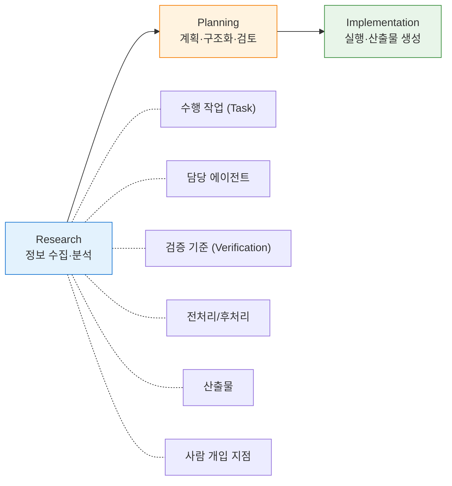

**3단계가 구조적 제약인 이유:**
- **Research를 건너뛰면**: 에이전트가 불충분한 정보로 작업 → 품질 하락 (절대 기준 1 위반)
- **Planning을 건너뛰면**: 사람 검토 없이 구현 진행 → 방향 오류 누적
- **Implementation이 없으면**: 설계도만 존재하는 미완성 시스템 (핵심 신념 위반)

---

## 4. 구성 요소 아키텍처 (Component Architecture)

### 4.1 구성 요소 전체 관계

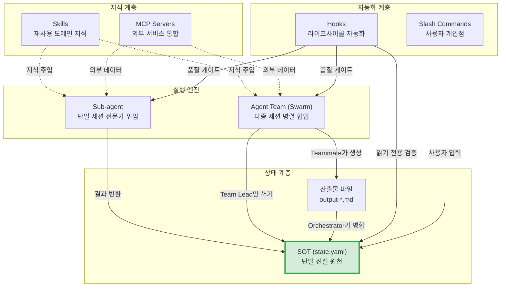

### 4.2 Sub-agent — 단일 세션 전문가 위임

**설계 사상:** 단일 전문가가 깊은 맥락을 유지하며 일관되게 처리해야 품질이 나오는 작업에 사용한다.

```
Orchestrator ──── 위임 ────→ @researcher (단일 세션)
                               │
                               ├── 독립 컨텍스트
                               ├── 전문 도구만 허용
                               ├── 결과만 반환
                               └── Orchestrator가 SOT 갱신
```

**정의 위치:** `.claude/agents/*.md`

**핵심 설계 원칙:**
- **단일 책임**: 에이전트당 하나의 역할
- **도구 최소화**: 필요한 도구만 할당 (보안과 집중)
- **모델 적정 배치**: 작업 복잡도에 따른 모델 선택

**모델 선택 기준 (품질 중심):**

| 모델 | 적합한 작업 | 선택 근거 |
|------|-----------|----------|
| `opus` | 복잡한 분석, 연구, 작문 | 최고 품질이 필요한 핵심 작업 |
| `sonnet` | 수집, 스캐닝, 구조화 | 안정적 품질의 반복 작업 |
| `haiku` | 상태 확인, 단순 판단 | 복잡도가 낮은 보조 작업 |

> **주의:** 모델 선택도 품질 기준이다. "haiku가 싸니까"가 아닌 "haiku의 품질이 이 작업에 충분한가"로 판단한다.

**Frontmatter 설계:**

```yaml
name: researcher           # 고유 식별자
description: "..."         # 자동 위임 트리거 설명
model: sonnet              # opus / sonnet / haiku
tools: Read, Glob, Grep    # 허용 도구 (최소 원칙)
disallowedTools: Write     # 차단 도구 (선택적)
permissionMode: default    # default / plan / dontAsk
maxTurns: 30               # 최대 턴 수
memory: project            # user / project / local
skills: [writing-style]    # 주입할 스킬
mcpServers: [slack]        # 사용 가능 MCP
hooks:                     # 에이전트 스코프 훅
  PreToolUse: [...]
```

### 4.3 Agent Team (Swarm) — 다중 세션 병렬 협업

**설계 사상:** 서로 다른 전문 영역을 각각 최고 수준으로 깊이 처리하거나, 다관점 분석·교차 검증으로 단일 에이전트보다 풍부한 결과를 얻어야 할 때 사용한다.

```
┌──────────────────────────────────────────────────┐
│                    Team Lead                      │
│  (TaskCreate → 할당 → SendMessage → 조율)          │
│  ★ SOT 쓰기 권한: state.yaml 갱신은 Team Lead만    │
├──────────┬──────────┬────────────────────────────┤
│ Teammate │ Teammate │ Teammate                    │
│@researcher│ @writer │ @data-processor             │
│(독립 세션) │(독립 세션)│ (독립 세션)                  │
│ 읽기 전용  │ 읽기 전용 │ 읽기 전용                    │
└──────────┴──────────┴────────────────────────────┘
     │            │           │
     ├── Shared Task List ────┤  ← 작업 할당/추적
     │  (~/.claude/tasks/)    │
     └── SOT (state.yaml) ───┘  ← 워크플로우 상태
```

**SOT 쓰기 규칙 (절대 기준 2 적용):**

| 역할 | SOT 파일 | 산출물 파일 |
|------|---------|-----------|
| Team Lead | **읽기+쓰기** (유일한 쓰기 권한자) | 생성 가능 |
| Teammate | 읽기 전용 | **생성만 가능** (output-a.md 등) |
| Hook | 읽기 전용 (검증용) | 상태 변경 불가 |

**SOT 흐름 — 기본 패턴:**

```
Teammate A → output-a.md 생성
Teammate B → output-b.md 생성
     ↓ 완료 통보 (SendMessage)
Team Lead → state.yaml에 상태 병합 (유일한 쓰기 지점)
     ↓
다음 단계로 진행
```

**SOT 흐름 — 품질 우선 패턴 (절대 기준 1 > 절대 기준 2):**

```
Teammate A → output-a.md 생성
     ↓ Teammate B가 output-a.md를 직접 참조 (교차 검증)
Teammate B → output-b.md 생성 (output-a.md 반영)
     ↓ 완료 통보 (SendMessage)
Team Lead → state.yaml에 최종 상태 병합 (SOT 단일 기록 유지)
```

> **적용 조건:** 팀원 간 산출물 직접 참조는 교차 검증, 피드백 루프 등 **품질 향상이 입증되는 경우에만** 허용한다. 단순 편의를 위한 직접 참조는 허용하지 않는다.

**Sub-agent vs Agent Team — 선택 기준:**

> 속도나 비용이 아닌, **어떤 구조가 최종 결과물의 품질을 가장 높이는가**로 선택한다.

| 구조 | 품질을 높이는 경우 |
|------|-----------------|
| **Agent Team** | 서로 다른 전문 영역을 각각 최고 수준으로 처리 / 다관점 교차 검증 / 독립 컨텍스트에서 100% 집중 |
| **Sub-agent** | 하나의 전문가가 깊은 맥락을 유지하며 일관 처리 / 단계 간 맥락 전달의 정확성이 핵심 / 순차적 의존성이 강함 |

### 4.4 Hooks — 라이프사이클 자동화

**설계 사상:** Hooks는 결정론적 자동화이다. AI의 확률적 판단이 아닌, 코드 기반의 정해진 규칙으로 품질 게이트와 자동화를 구현한다.

**Hook 이벤트 라이프사이클:**

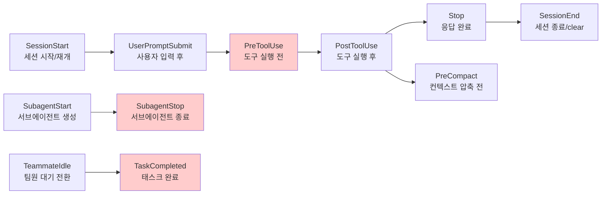

주황색 노드는 **차단 가능(blocking)** 이벤트 — exit code 2로 동작을 차단하고 피드백을 전달할 수 있다.

> **Context Preservation System + Safety Hooks**: 이 프로젝트는 SessionStart, PostToolUse, Stop, PreCompact, SessionEnd 5개 hook으로 컨텍스트 보존 시스템을 운용하고, PreToolUse 3개 hook으로 위험 명령 차단(Safety Hook) + TDD 테스트 파일 보호(TDD Guard) + 에러 이력 기반 위험 파일 경고(Predictive Debugging)를 수행한다 (총 8개 hook 이벤트). `/clear` 또는 컨텍스트 압축 시 작업 내역을 자동 저장하고, 새 세션 시작 시 RLM 패턴(포인터 + 요약)으로 복원한다. 위험한 Bash 명령(git push --force, git reset --hard 등)은 PreToolUse에서 정규식 기반으로 결정론적 차단된다. 상세는 `.claude/hooks/scripts/` 참조.

**Hook 3가지 타입:**

| 타입 | 실행 방식 | 적합한 용도 |
|------|----------|-----------|
| `command` | 셸 스크립트 실행 | 포맷 검증, 보안 체크, 파일 변환 |
| `prompt` | LLM 단일턴 판단 | API 호환성 평가, 간단한 품질 판단 |
| `agent` | 서브에이전트 기반 검증 (최대 50턴) | 테스트 실행, 복잡한 품질 검증 |

**Exit Code 규칙:**

| 코드 | 동작 | 사용 시점 |
|------|------|---------|
| `0` | 통과 (JSON 출력 파싱) | 정상 |
| `2` | 차단 (stderr → Claude에 피드백) | 위험 행동 방지, 품질 미달 |
| 기타 | 논블로킹 에러 (로그만) | 디버그 |

**설정 위치 계층:**

| 위치 | 범위 | 공유 가능 |
|------|------|----------|
| `~/.claude/settings.json` | 전역 (모든 프로젝트) | 아니오 |
| `.claude/settings.json` | 프로젝트 | 예 (커밋 가능) |
| `.claude/settings.local.json` | 프로젝트 (로컬) | 아니오 |
| Agent frontmatter `hooks:` | 에이전트 스코프 | 예 |

### 4.5 Slash Commands — 사용자 개입점

**설계 사상:** Slash Commands는 워크플로우에서 **사람의 판단이 필요한 지점**을 구조화한다. 자동화할 수 없는 검토, 승인, 선택을 명시적으로 정의한다.

**정의 위치:** `.claude/commands/*.md`

**워크플로우 표기:** `(human)` 태그와 함께 사용

```markdown
### 3. (human) 인사이트 검토 및 선정
- **Action**: 글로 작성할 인사이트 선택
- **Command**: `/review-insights`
```

**주요 패턴:**
- **검토 후 진행**: 이전 단계 결과물 표시 → 승인/반려/수정요청
- **선택형 입력**: 옵션 목록 표시 → 번호 또는 항목 선택
- **피드백 전달**: 반려 시 구체적 피드백을 에이전트에 전달하여 재작업

### 4.5-1 AskUserQuestion — 동적 사용자 질문

**설계 사상:** Slash Commands가 **사전 정의된** 검토·승인·선택을 구조화한다면, AskUserQuestion은 **실행 중 동적으로** 발생하는 질문을 처리한다. 워크플로우 실행 과정에서 예측할 수 없는 사용자 판단이 필요할 때 사용한다.

**Slash Command와의 차이:**

| 특성 | Slash Command | AskUserQuestion |
|------|-------------|-----------------|
| **질문 시점** | 사전 정의 (workflow.md에 명시) | 실행 중 동적 발생 |
| **선택지** | 고정 (커맨드에 정의) | 동적 (상황에 따라 생성) |
| **P4 규칙** | 적용 | 적용 (최대 4개 질문, 각 3개 선택지) |
| **사용 예** | "인사이트 검토 및 선정" | "에이전트 실패 후 대안 선택" |

**적합한 경우:**
- Orchestrator가 에스컬레이션 시 사용자 판단이 필요할 때
- 조건 분기에서 자동 판단이 어려운 경우
- 에이전트 실패 후 대안 경로 선택이 필요할 때

### 4.6 Skills — 재사용 도메인 지식 패키지

**설계 사상:** Skills는 검증된 도메인 지식과 패턴을 캡슐화하여 일관되게 적용하는 재사용 모듈이다. 단순 프롬프트 모음이 아닌, **WHY/WHAT/HOW/VERIFY 체계**를 갖춘 구조화된 지식 패키지다.

**(상세는 §7.2에서 서술)**

### 4.7 MCP Servers — 외부 서비스 통합

**설계 사상:** MCP(Model Context Protocol) Servers는 외부 서비스(Notion, Slack, 데이터베이스 등)를 에이전트 워크플로우에 통합한다.

**설정 위치:** `.mcp.json` 또는 `.claude/settings.json`

```json
{
  "mcpServers": {
    "notion": {
      "command": "npx",
      "args": ["-y", "@notionhq/mcp-server"],
      "env": { "NOTION_TOKEN": "${NOTION_TOKEN}" }
    }
  }
}
```

### 4.8 SOT 상태관리 — 쓰기 권한 모델

**설계 사상 (절대 기준 2의 구현):** 수십 개의 에이전트가 동시에 작동해도 데이터 불일치가 발생하지 않도록, **단일 파일에 모든 공유 상태를 집중**하고 **쓰기 권한을 단일 지점으로 제한**한다.

**SOT 파일 구조:**

```yaml
# .claude/state.yaml — 단일 SOT 파일
workflow:
  name: "blog-pipeline"
  current_step: 3
  status: "paused"           # running / paused / completed / error
  outputs:
    step-1: "raw-contents.md"
    step-2: "insights-list.md"
  pending_input:
    type: "selection"
    options: [...]
```

**계층적 메모리 구조:**

```
전역 메모리 (SOT — 단일 파일)
  └─ .claude/state.yaml
       ├─ workflow 상태 (current_step, status)
       ├─ 단계별 산출물 경로 (outputs)
       └─ 에러/롤백 정보

로컬 메모리 (에이전트별 — 각자의 작업 컨텍스트)
  ├─ Sub-agent: 위임받은 Task + 이전 단계 산출물 (읽기 전용)
  ├─ Teammate: 할당된 Task + 필요 입력 파일 (읽기 전용)
  └─ Hook: 검증 대상 산출물 (읽기 전용)
```

> **핵심:** Task List (`~/.claude/tasks/`)는 **작업 할당/추적 도구**이지 워크플로우 상태(SOT)가 아니다. 진행 상태·산출물 경로·에러 정보는 반드시 SOT 파일에서 관리한다.

### 4.9 구성 요소 비교 요약

| 특성 | Sub-agent | Agent Team | Hook | Slash Command | AskUserQuestion | Task System | Skill | MCP Server |
|------|-----------|------------|------|---------------|-----------------|-------------|-------|------------|
| **역할** | 전문가 위임 | 병렬 협업 | 자동 검증 | 사용자 개입점 | 동적 질문 | 작업 추적 | 지식 주입 | 외부 연동 |
| **세션** | 단일 (위임) | 다중 (독립) | N/A | N/A | N/A | N/A | N/A | N/A |
| **컨텍스트** | 부모와 분리 | 완전 독립 | 없음 | 없음 | 현재 세션 | 팀 공유 | 세션 주입 | 세션 주입 |
| **SOT 관계** | Orchestrator가 갱신 | Team Lead만 갱신 | 읽기 전용 | 사용자 입력 반영 | 사용자 입력 반영 | SOT와 분리 | 무관 | 무관 |
| **품질 기여** | 전문 집중 | 다관점 병렬 | 결정론적 검증 | 사람의 판단 | 구조화된 수집 | 의존성 관리 | 검증된 패턴 | 외부 데이터 |
| **적합한 작업** | 집중·순차 작업 | 병렬 협업 | 검증·포맷팅·게이트 | 검토·승인·선택 | 에스컬레이션·분기 판단 | Agent Team 조율 | 도메인 지식 적용 | 외부 서비스 통합 |

### 4.10 Context Preservation System — 컨텍스트 보존 시스템

**설계 사상:** Claude Code의 컨텍스트 윈도우가 소진되면(`/clear`, 컨텍스트 압축), 진행 중이던 작업의 맥락이 완전히 상실된다. 이 시스템은 RLM 패턴을 적용하여 작업 내역을 **외부 메모리 객체**(MD 파일)로 영속화하고, 새 세션에서 포인터 기반으로 복원한다.

**RLM 패턴 적용:**

RLM 논문의 핵심 원칙 — "프롬프트를 신경망에 직접 넣지 말고, 외부 환경의 객체로 취급하라" — 을 컨텍스트 보존에 적용했다:

| RLM 개념 | Context Preservation 대응 | 설계 근거 |
|---------|-------------------------|----------|
| 외부 환경 객체 | `.claude/context-snapshots/latest.md` | 스냅샷을 외부 파일로 영속화 |
| 포인터 기반 접근 | `restore_context.py`가 포인터+요약+완료상태+Git상태 출력 | Claude가 Read tool로 전체 로드 (직접 주입 아님) |
| Code-based Filtering | `_context_lib.py`가 트랜스크립트를 결정론적으로 파싱. 10개 절삭 상수(EDIT_PREVIEW_CHARS=1000, ERROR_RESULT_CHARS=3000 등) 중앙화. 설계 결정 추출 시 품질 태그 우선 정렬(`[explicit]` > `[decision]` > `[rationale]` > `[intent]`)로 노이즈 제거 | P1 원칙: 코드가 정제, AI가 해석 |
| Variable Persistence | `work_log.jsonl`로 중간 상태 영속 저장 (9개 도구 추적) | 도구 사용마다 누적, 스냅샷 생성 시 활용 |
| 프로그래밍적 탐색 | `knowledge-index.jsonl` — Grep으로 검색 가능. phase, phase_flow, primary_language, error_patterns(+resolution), tool_sequence, final_status, tags, session_duration_entries 메타데이터 포함 | 과거 세션을 코드로 탐색 (RLM sub-call 대응) |
| 에러 분류 + 해결 매칭 | Error Taxonomy 12패턴 — 도구 에러를 결정론적으로 분류. false positive 방지(negative lookahead, 한정어 매칭). **Error→Resolution 매칭**: 에러 후 5 entries 이내 성공 호출을 file-aware로 탐지 → `resolution` 필드 기록 | P1 원칙: 에러 분류와 해결 패턴 모두 코드가 수행 |
| Predictive Debugging | `aggregate_risk_scores()` — Knowledge Archive의 error_patterns를 파일별 집계(가중치 × 감쇠). SessionStart에서 `risk-scores.json` 캐시 생성 → `predictive_debug_guard.py`(PreToolUse)가 매 Edit/Write마다 캐시 조회 → 임계값 초과 시 stderr 경고 (exit 0). RS1-RS6 P1 검증 | Error Taxonomy(ADR-017) 데이터를 **사전 예측**에 활용하는 L-1 계층. 차단하지 않고 경고만 → 워크플로우 비방해 |
| 다단계 전환 감지 | `detect_phase_transitions()` — sliding window(20개 도구, 50% 오버랩)로 세션 내 단계 변화 추적 | 세션 구조를 결정론적으로 분류 (research/planning/implementation/orchestration) |
| IMMORTAL-aware 압축 | 스냅샷 크기 초과 시 IMMORTAL 섹션 우선 보존, 비-IMMORTAL 콘텐츠 먼저 절삭. **압축 감사 추적**: Phase 1~7 delta를 HTML 주석으로 기록 | 세션 경계에서 핵심 맥락 유실 방지 + 디버깅 가능 |
| Resume Protocol | 스냅샷 내 결정론적 복원 지시 섹션. **동적 RLM 쿼리 힌트**: `extract_path_tags()`로 경로 태그 추출 → 세션별 맞춤 Grep 예시 자동 생성 | 복원 품질의 바닥선(floor) 보장 |
| 경로 태그 추출 | `extract_path_tags()` — CamelCase/snake_case 분리 + 확장자 매핑(`_EXT_TAGS`)으로 언어 독립적 검색 태그 생성 | Knowledge Archive의 `tags` 필드 + RLM 쿼리 힌트의 기반 |
| P1 할루시네이션 봉쇄 | KI 스키마 검증(`_validate_session_facts`), 부분 실패 격리(`archive_and_index_session`), SOT 쓰기 패턴 검증(AST 기반), SOT 스키마 검증(`validate_sot_schema` — 8항목: S1-S6 기본 + S7 pacs 5필드 + S8 active_team 5필드), **위험 명령 차단**(`block_destructive_commands.py` — PreToolUse, 8개 정규식 패턴), **시크릿 탐지**(`output_secret_filter.py` — PostToolUse, 3-tier 추출, 25+ 패턴), **보안 민감 파일 경고**(`security_sensitive_file_guard.py` — PostToolUse, 12 패턴), **Adversarial Review P1 검증**(`validate_review.py` — R1-R5 + pACS Delta + Review→Translation 순서). **131개 Safety 테스트**: 44(secret)+44(sensitive)+43(destructive) | 반복 정확 작업을 코드로 강제 |

**스크립트 아키텍처와 데이터 흐름:**

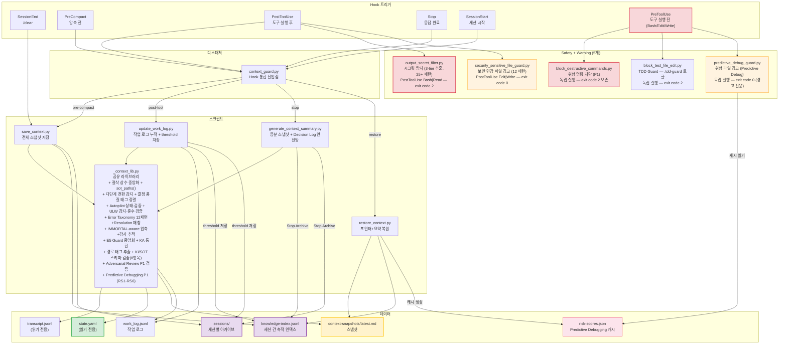

**SOT 준수 (절대 기준 2):**

| 대상 | 접근 권한 | 근거 |
|------|---------|------|
| `state.yaml` (SOT) | **읽기 전용** — 스냅샷에 SOT 상태를 기록하지만 수정하지 않음 | 절대 기준 2: SOT 쓰기는 Orchestrator만 |
| `transcript.jsonl` | **읽기 전용** — 대화 내역 파싱 | Claude Code 시스템 파일, 수정 불가 |
| `context-snapshots/` | **쓰기** — atomic write (temp → rename) | Hook 전용 산출물 디렉터리, SOT와 분리 |
| `work_log.jsonl` | **쓰기** — append: fcntl.flock 파일 잠금, 절삭(proactive save): atomic write (temp → rename) | Hook 전용 로그, SOT와 분리 |
| `knowledge-index.jsonl` | **쓰기** — `archive_and_index_session()` (`save_context.py` + `generate_context_summary.py` + `update_work_log.py`에서 호출). fcntl.flock 파일 잠금 + os.fsync 내구성 보장. TOCTOU race 방지 (try/except FileNotFoundError 패턴). KI 스키마 검증(`_validate_session_facts` — 11개 필수 키 보장, diagnosis_patterns 포함). 부분 실패 격리(archive 실패가 index 갱신 차단 안 함) | 세션 간 축적 인덱스, SOT와 분리. session_id 기반 dedup (빈 ID/"unknown" 제외). completion_summary, git_summary, session_duration_entries, phase, phase_flow, primary_language, error_patterns(Error Taxonomy 12패턴 + resolution 매칭), tool_sequence(RLE 압축), final_status(success/incomplete/error/unknown), tags(경로 기반 검색 태그 — CamelCase/snake_case 분리 + 확장자 매핑) 포함 |
| `sessions/` | **쓰기** — `archive_and_index_session()` (`save_context.py` + `generate_context_summary.py` + `update_work_log.py`에서 호출) | 세션 아카이브, SOT와 분리 |
| `autopilot-logs/` | **쓰기** — Decision Log 안전망 (`generate_context_summary.py`, Autopilot 활성 시에만) | Autopilot 자동 승인 결정 로그, SOT와 분리 |
| `.claude/hooks/setup.init.log` | **쓰기** — `setup_init.py` (Setup init Hook: Python 버전, PyYAML, 스크립트 구문×13, 디렉터리×3(context-snapshots, sessions, 런타임 5개), .gitignore, SOT 쓰기 패턴 검증) | 인프라 검증 결과 로그, `/install` 슬래시 커맨드가 분석 |
| `.claude/hooks/setup.maintenance.log` | **쓰기** — `setup_maintenance.py` (Setup maintenance Hook) | 건강 검진 결과 로그, `/maintenance` 슬래시 커맨드가 분석 |

**P1 원칙 적용 (정확도를 위한 데이터 정제):**

| 처리 | 담당 | 방식 |
|------|------|------|
| 트랜스크립트 파싱, 통계 산출 | **Python** (`_context_lib.py`) | 결정론적 — heuristic 추론 없음 |
| 시스템 메시지 필터링 | **Python** (`_context_lib.py`) | `<system-reminder>` 등 자동 분류 |
| 스냅샷 구조화 (섹션 배치, 압축) | **Python** (`_context_lib.py`) | verbatim 인용 + 구조화 메타데이터 |
| Resume Protocol 생성 (수정/참조 파일 목록) | **Python** (`_context_lib.py`) | 결정론적 — tool_use 메타데이터에서 추출 |
| 완료 상태 추출 (도구 성공/실패) | **Python** (`_context_lib.py`) | 결정론적 — tool_use_id ↔ tool_result O(1) 딕셔너리 매칭 |
| 다단계 전환 감지 | **Python** (`_context_lib.py`) | 결정론적 — sliding window(20 도구, 50% 오버랩)로 phase 변화 추적 |
| 설계 결정 추출 + 품질 태그 정렬 | **Python** (`_context_lib.py`) | 결정론적 — 4개 패턴(`[explicit]`/`[decision]`/`[rationale]`/`[intent]`) 추출 후 품질 우선 정렬 |
| 에러 패턴 분류 + 해결 매칭 (Error Taxonomy) | **Python** (`_context_lib.py`) | 결정론적 — 12개 regex 패턴으로 에러 유형 분류. false positive 방지. Error→Resolution 매칭: 에러 후 5 entries 이내 성공 호출을 file-aware 탐지 |
| 경로 태그 추출 | **Python** (`_context_lib.py`) | 결정론적 — `extract_path_tags()` CamelCase/snake_case 분리 + `_EXT_TAGS` 확장자 매핑 |
| KI 스키마 검증 | **Python** (`_context_lib.py`) | 결정론적 — `_validate_session_facts()` 11개 필수 키 보장 (누락 시 안전 기본값, diagnosis_patterns 포함) |
| SOT 스키마 검증 | **Python** (`_context_lib.py`) | 결정론적 — `validate_sot_schema()` 8항목 구조 무결성 검증 (S1-S6 기본 + S7 pacs 5필드(dimensions, current_step_score, weak_dimension, history, pre_mortem_flag) + S8 active_team 5필드(name, status(partial\|all_completed), tasks_completed, tasks_pending, completed_summaries)) |
| pACS P1 검증 | **Python** (`_context_lib.py` + `validate_pacs.py`) | 결정론적 — `validate_pacs_output()` PA1-PA6 pACS 로그 구조 무결성 검증 (파일 존재, 최소 크기, 차원 점수 0-100, Pre-mortem 존재, min() 산술, Color Zone 정합성) |
| L0 Anti-Skip Guard | **Python** (`_context_lib.py` + `validate_pacs.py`) | 결정론적 — `validate_step_output()` L0a-L0c 산출물 물리적 존재 검증 (SOT outputs에서 경로 추출, 파일 존재, ≥100 bytes, 비공백) |
| Team Summaries KI 보존 | **Python** (`_context_lib.py`) | 결정론적 — `_extract_team_summaries()` SOT active_team.completed_summaries를 Knowledge Archive에 보존 (스냅샷 로테이션 시 유실 방지) |
| 도구 시퀀스 압축 (RLE) | **Python** (`_context_lib.py`) | 결정론적 — Run-Length Encoding으로 도구 호출 시퀀스 압축 (예: `Read(3)→Edit→Bash`) |
| 시스템 명령 필터링 | **Python** (`_context_lib.py`) | 결정론적 — `/clear`, `/help` 등 시스템 명령을 "현재 작업" 추출에서 제외 |
| Git 상태 캡처 | **Python** (`_context_lib.py`) | 결정론적 — subprocess.run으로 git 명령 실행 |
| 세션 간 인덱스 프로그래밍적 탐색 | **AI** (Claude) | Grep tool로 knowledge-index.jsonl 검색 |
| 복원된 스냅샷 해석, 작업 맥락 파악 | **AI** (Claude) | Read tool로 스냅샷 로드 후 의미 해석 |

**안전성 보장:**

- **Atomic write**: 모든 파일 쓰기(스냅샷, 아카이브, work_log 절삭)는 temp file → `os.rename` 패턴으로 중간 상태 노출 및 프로세스 크래시 시 부분 쓰기 방지
- **Smart Throttling**: Stop hook은 30초 dedup window + 5KB growth threshold로 노이즈 감소. SessionEnd/PreCompact는 5초 window. SessionEnd는 dedup 면제
- **E5 Empty Snapshot Guard**: 다중 신호 감지(크기 ≥3KB OR ≥2개 섹션 마커)로 풍부한 latest.md를 빈 스냅샷 덮어쓰기에서 보호. `is_rich_snapshot()` + `update_latest_with_guard()` 중앙 함수로 Stop hook + save_context.py 모두 적용
- **IMMORTAL-aware 압축**: Phase 7 hard truncate에서 IMMORTAL 섹션을 우선 보존. 비-IMMORTAL 콘텐츠를 먼저 절삭하고, 극단적 경우에도 IMMORTAL 텍스트의 시작 부분을 보존하여 핵심 맥락 유실 방지. **압축 감사 추적**: 각 Phase가 제거한 문자 수를 HTML 주석(`<!-- compression-audit: ... -->`)으로 스냅샷 끝에 기록 (Phase 1~7 delta + 최종 크기)
- **File locking**: `work_log.jsonl`(append) 및 `knowledge-index.jsonl` 접근 시 `fcntl.flock` 파일 잠금 + `os.fsync()` 내구성 보장으로 동시성 보호. `work_log.jsonl` 절삭(proactive save)은 atomic write 패턴 적용
- **TOCTOU race 방지**: `knowledge-index.jsonl`의 생성·갱신에서 `os.path.exists()` 검사 대신 `try/except FileNotFoundError` 패턴을 사용하여 경쟁 조건을 원천 차단
- **Session dedup 보호**: session_id가 빈 문자열이거나 `"unknown"`인 경우 중복 제거를 건너뛰어 데이터 유실 방지
- **SOT 경로 통합**: `sot_paths()` 헬퍼와 `SOT_FILENAMES` 상수로 SOT 파일 경로를 단일 정의 지점에서 관리 (3중 하드코딩 제거)
- **절삭 상수 중앙화**: 10개 절삭 상수(`EDIT_PREVIEW_CHARS`, `ERROR_RESULT_CHARS`, `MIN_OUTPUT_SIZE` 등)를 `_context_lib.py`에 중앙 정의하여 스냅샷 품질을 일관되게 관리
- **Non-blocking / Blocking 구분**: Context Preservation Hook은 exit 0 반환 (비차단). Safety Hook 중 `block_destructive_commands.py`, `output_secret_filter.py`는 exit 2로 **차단**. 나머지(`predictive_debug_guard.py`, `security_sensitive_file_guard.py`)는 exit 0 (경고 전용)
- **Knowledge Archive 로테이션**: `knowledge-index.jsonl` 최대 200 엔트리, `sessions/` 최대 20 파일 유지

**Hook 설정 통합 (Project-only):**

모든 Hook은 `.claude/settings.json` (Project)에 통합 정의되어 `git clone`만으로 자동 적용된다.

| 이벤트 그룹 | Hook 이벤트 | 스크립트 |
|------------|------------|---------|
| Context Preservation | Stop, PostToolUse, PreCompact, SessionStart | `context_guard.py` → 4개 전문 스크립트로 디스패치 |
| Safety (PreToolUse) | PreToolUse (Bash) | `block_destructive_commands.py` (독립 실행) |
| TDD Guard | PreToolUse (Edit\|Write) | `block_test_file_edit.py` (독립 실행) |
| Predictive Debug | PreToolUse (Edit\|Write) | `predictive_debug_guard.py` (독립 실행) |
| Safety (PostToolUse) | PostToolUse (Bash\|Read) | `output_secret_filter.py` (3-tier 시크릿 탐지, 독립 실행) |
| Security Guard | PostToolUse (Edit\|Write) | `security_sensitive_file_guard.py` (보안 민감 파일 경고, 독립 실행) |
| Session Lifecycle | SessionEnd, Setup (init/maintenance) | `save_context.py`, `setup_init.py`, `setup_maintenance.py` |

---

## 5. 설계 원칙 (Design Principles)

> **참조 번호 주의**: 이 문서의 §5.x는 설계 원칙(P1~P4 + 교차 관심사)을 다룬다. Spoke 파일이나 SKILL.md에서 `§5.1 Autopilot`, `§5.3 Verification`, `§5.4 pACS`로 참조하는 것은 **AGENTS.md §5.x**(구현 요소)이다.

설계 원칙은 절대 기준에 종속되는 하위 원칙이다. 절대 기준이 "무엇을 최적화하는가"를 정의하고, 설계 원칙은 "어떻게 최적화하는가"를 정의한다.

### 5.1 P1: 정확도를 위한 데이터 정제

큰 데이터를 AI에게 그대로 전달하면 노이즈로 정확도가 하락한다.

```
                     ┌─────────────────┐
 Raw Data ─────────→│  Pre-processing  │──── 정제된 데이터 ────→ AI Agent
 (HTML, JSON, CSV)   │  (Python script) │                       (판단·분석·생성)
                     └─────────────────┘
                                                                    │
                     ┌─────────────────┐                            ▼
 최종 산출물 ←────── │ Post-processing  │←─── Agent 산출물
                     │  (중복 제거 등)   │
                     └─────────────────┘
```

**역할 분담:**

| 처리 유형 | 담당 | 예시 |
|---------|------|------|
| 데이터 필터링 (날짜, 키워드) | **Code** (Python) | 날짜 범위 필터, 키워드 매칭 |
| 중복 제거 (hash, 유사도) | **Code** (Python) | MD5 해시, 코사인 유사도 |
| 포맷 변환 (HTML→텍스트) | **Code** (Python) | BeautifulSoup, regex |
| 연관관계 계산 (통계) | **Code** (Python) | 빈도 분석, 그래프 구성 |
| 의미 분석, 판단, 요약 | **AI Agent** | 인사이트 추출, 핵심 요약 |
| 창의적 생성, 작문 | **AI Agent** | 콘텐츠 작성, 아이디어 생성 |

이 원칙은 RLM 논문의 "Code-based Filtering" 패턴과 정확히 대응한다. 결정론적 연산(Python)으로 노이즈를 제거한 후, 확률론적 추론(LLM)이 깨끗한 데이터에서 판단에 집중하는 구조이다.

```
Bad:  "수집된 전체 웹페이지 HTML을 에이전트에 전달"
Good: "Python script로 본문만 추출 → 핵심 텍스트만 에이전트에 전달"
```

### 5.2 P2: 전문성 기반 위임 구조

각 작업을 가장 잘 수행할 수 있는 전문 에이전트에게 위임하여 품질을 극대화한다. Orchestrator는 전체 품질을 조율하고, 전문 에이전트는 각자의 영역에 깊이 집중한다.

```
Orchestrator (품질 조율 + 흐름 관리)
  ├→ Agent A: 전문 리서치 (해당 도메인 최적화)
  ├→ Agent B: 심층 분석 (분석에만 집중)
  └→ Agent C: 검증 및 품질 게이트
```

**핵심:** Orchestrator가 "모든 것을 하는" 구조는 안티패턴이다. Orchestrator는 조율자이고, 실행은 전문 에이전트가 담당한다.

### 5.3 P3: 리소스 정확성

이미지, 파일, 외부 리소스가 필요한 단계에서는 **정확한 경로를 명시**한다. Placeholder 누락은 불가하다.

```
Bad:  "적절한 이미지를 다운로드하여 사용"
Good: "https://example.com/chart-2024.png 다운로드 → assets/chart.png에 저장"
```

### 5.4 P4: 질문 설계 규칙

사용자에게 질문할 때의 엄격한 규칙:
- **최대 4개**까지만 질문
- 각 질문에 **3개** 정도의 선택지 제공
- 모호한 부분이 없으면 **질문 없이 진행**

이 원칙은 사용자 피로도를 최소화하면서 필요한 정보를 정확히 수집하기 위한 것이다.

### 5.5 English-First 실행 및 번역 프로토콜 (MANDATORY)

> **이 프로토콜은 절대 기준과 동급의 강제 사항이다. 예외 없이 반드시 준수한다.** (ADR-027a)

워크플로우 **실행** 시 모든 에이전트는 **영어로 작업**하고 **영어로 산출물**을 생성한다. **최종 결과물은 반드시 영어로 먼저 완성한 후, `@translator`로 한국어 번역을 생성한다. 이 순서는 역전 불가.**

**강제 근거 (절대 기준 1 — 품질의 직접적 구현):**

1. **토큰 효율성** — 한국어는 토큰 소비가 2-3배 높음
2. **정확도 향상** — LLM의 주 학습 언어로 더 정밀한 이해·생성
3. **할루시네이션 감소** — 영어가 한국어보다 할루시네이션 발생률이 낮음
4. **일관성 보장** — 영어 프롬프트는 해석의 모호함이 적음

**언어 경계:**

| 활동 | 언어 | 강제 여부 |
|------|------|----------|
| 워크플로우 설계 (`workflow-generator` 스킬) | 한국어 | 허용 (사용자 대화) |
| 에이전트 정의 (`.claude/agents/*.md`) | **영어** | **강제** |
| 워크플로우 실행 (에이전트 작업) | **영어** | **강제** |
| 최종 산출물 | **영어 원본 먼저** → 한국어 번역 | **강제** |
| 프레임워크 문서·사용자 대화 | 한국어 | 허용 |

**번역 프로토콜:**

- `@translator` 서브에이전트가 각 단계의 영어 산출물을 한국어로 번역
- `translations/glossary.yaml`이 RLM 외부 영속 상태로서 용어 일관성을 유지
- `memory: project`가 문체·어투 패턴을 암시적으로 축적하여 glossary.yaml과 2계층 메모리를 구성 (ADR-051)
- SOT에 `step-N-ko` 키로 번역 경로 기록 (`.isdigit()` 가드가 자동 스킵)

이 설계는 RLM 논문의 Variable Persistence 패턴과 대응한다: 용어집이 외부 환경 객체로서 서브에이전트 호출 간 상태를 유지한다.

> **상세**: AGENTS.md §5.2 참조

### 5.6 Verification Protocol (작업 검증)

워크플로우 각 단계의 산출물이 **기능적 목표를 100% 달성했는지** 검증하는 프로토콜이다. 이것은 P1(데이터 정제)의 사후 적용이자, 절대 기준 1(품질)의 직접적 구현이다.

**핵심 원칙:** "완료의 정의를 먼저 선언하고, 실행 후 검증하고, 실패 시 재실행한다."

**2계층 품질 보장 아키텍처:**

```
품질 보장 계층:

  Anti-Skip Guard (Hook — 결정론적)
    "파일이 존재하고, 의미 있는 크기인가?"
      ↓ PASS
  Verification Gate (Agent — 의미론적)
    "기능적 목표를 100% 달성했는가?"
      ↓ PASS
  SOT 갱신 + 다음 단계 진행
```

Anti-Skip Guard가 **물리적 존재**를, Verification Gate가 **내용적 완전성**을 보장한다. 두 계층은 독립적으로 동작하며, 둘 다 통과해야 다음 단계로 진행한다.

**4가지 검증 기준 유형:**

| 유형 | 검증 대상 | 예시 |
|------|---------|------|
| **구조적 완전성** | 산출물 내부 구조 | "5개 섹션 모두 포함" |
| **기능적 목표** | 작업 목표 달성 | "경쟁사별 3개 이상 tier + 정확한 금액" |
| **데이터 정합성** | 데이터 정확성 | "모든 URL이 유효, placeholder 없음" |
| **파이프라인 연결** | 다음 단계 입력 호환 | "Step 4가 필요로 하는 필드 포함" |

**실행 흐름:**

```
1. 검증 기준 읽기 (Task보다 먼저)
2. 단계 실행 (절대 기준 1 — 완전한 품질)
3. Anti-Skip Guard (결정론적)
4. Verification Gate (의미론적 자기 검증)
   ├─ 모든 기준 PASS → verification-logs/step-N-verify.md → SOT 갱신
   └─ FAIL → 해당 부분만 재실행 (최대 10회) → 초과 시 사용자 에스컬레이션
```

**Team 단계 3계층 검증:**

| 계층 | 수행자 | 검증 대상 | SOT 쓰기 |
|------|--------|---------|---------|
| **L1** | Teammate (자기 검증) | 자기 Task의 검증 기준 | 없음 (세션 내부 완결) |
| **L1.5** | Teammate (pACS) | 자기 Task 산출물의 신뢰도 | 없음 (점수를 보고 메시지에 포함) |
| **L2** | Team Lead (종합 검증 + 단계 pACS) | 단계 전체의 검증 기준 | 있음 (SOT outputs + pacs 갱신) |

**하위 호환:** `Verification` 필드가 없는 단계는 기존 Anti-Skip Guard만으로 진행. 새 워크플로우 생성 시에는 필수 포함.

**RLM 패턴 대응:** `verification-logs/`는 RLM의 Variable Persistence에 해당하는 외부 메모리 객체이다. 검증 결과를 파일로 영속화하여 세션 경계를 넘어 추적 가능하다.

> **상세**: AGENTS.md §5.3 참조

### 5.7 pACS — predicted Agent Confidence Score (자체 신뢰 평가)

AlphaFold의 pLDDT(predicted Local Distance Difference Test)에서 영감을 받은 **에이전트 자기 신뢰도 평가 프로토콜**이다. Verification Protocol이 "완전성"을 보장한다면, pACS는 **"신뢰도"**를 수치화한다.

**핵심 메커니즘:**

| 구성 요소 | 설명 |
|----------|------|
| **3차원 평가** | F(Factual Grounding), C(Completeness), L(Logical Coherence) — 직교하는 3개 차원 |
| **Min-Score 원칙** | pACS = min(F, C, L) — 가중 평균 아닌 최약점 기준 |
| **Pre-mortem Protocol** | 점수 매기기 전 3개 약점 질문 필수 — 인플레이션 구조적 방지 |
| **행동 트리거** | GREEN(≥70 자동진행), YELLOW(50-69 플래그), RED(<50 재작업) |
| **Translation pACS** | Ft(Fidelity), Ct(Completeness), Nt(Naturalness) — 번역 품질 전용 |

**품질 보장 4계층 아키텍처:**

```
L0   Anti-Skip Guard (결정론적)    — 파일 존재 + ≥ 100 bytes
L1   Verification Gate (의미론적)   — 기능적 목표 100% 달성
L1.5 pACS Self-Rating (신뢰도)    — Pre-mortem + F/C/L 채점
L2   Adversarial Review (Enhanced) — @reviewer/@fact-checker 적대적 검토 (§5.5 of AGENTS.md)
```

**설계 결정 — "왜 가중 평균이 아닌 min-score인가":**

캘리브레이션 데이터 없이 자기 평가하는 에이전트가 5개 차원의 가중 평균을 계산하면, **정밀도 환상(precision illusion)**이 발생한다. 실제로는 주관적 추정인데 소수점 단위의 정밀한 점수가 나오는 구조적 문제이다. Min-score는 "가장 약한 부분이 전체 품질을 결정한다"는 보수적 원칙으로, 과신을 방지한다. 이는 AlphaFold에서 단백질 구조의 신뢰도가 가장 낮은 잔기(residue)가 전체 모델의 유용성을 결정하는 것과 같은 원리이다.

**설계 결정 — "왜 Pre-mortem이 필수인가":**

에이전트의 자기 평가는 본질적으로 자기 확인 편향(confirmation bias)에 노출된다. Pre-mortem Protocol은 점수를 매기기 **전에** 약점을 명시적으로 인식하게 함으로써, "모든 것이 잘 되었다"는 기본 프레이밍을 **"어디가 불확실한가"**로 전환한다.

**RLM 패턴 대응:** `pacs-logs/`는 Verification logs와 마찬가지로 RLM의 Variable Persistence에 해당한다. SOT의 `pacs.history` 필드는 세션 간 pACS 추이를 추적하여, 특정 워크플로우에서 반복적으로 낮은 차원(예: F가 항상 최저)을 식별하고 구조적 개선의 근거로 활용할 수 있다.

> **상세**: AGENTS.md §5.4 참조

---

## 6. 실행 패턴 (Execution Patterns)

구성 요소들이 조합되어 만드는 5가지 표준 실행 패턴이다.

### Pattern 1: Sequential Pipeline (Sub-agent 순차)

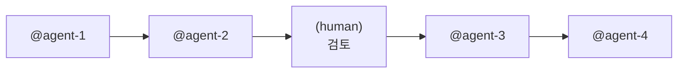

**품질 근거:** 단일 전문가의 깊은 맥락 유지가 결과 일관성·정확도를 높인다.

**적합한 경우:**
- 단계 간 맥락 전달의 정확성이 결과 품질의 핵심
- 순차적 의존성이 강해 앞 단계의 품질이 뒤 단계에 직결

### Pattern 2: Parallel Branches (Agent Team 병렬)

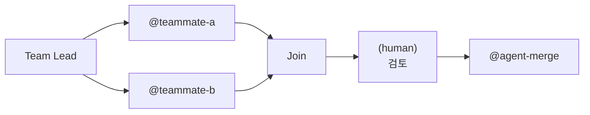

**품질 근거:** 각 전문가의 독립 집중 + 다관점 결합이 단일 에이전트보다 풍부한 품질을 달성한다.

**적합한 경우:**
- 서로 다른 전문 영역을 독립적으로 깊이 처리
- 다관점 분석·교차 검증이 필요

### Pattern 3: Conditional Flow (조건 분기)

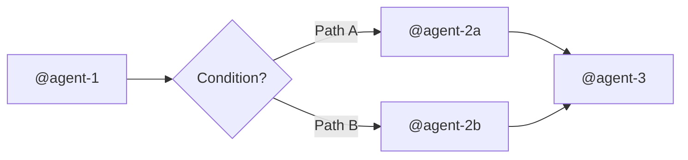

**적합한 경우:**
- 이전 단계의 결과에 따라 다른 경로로 진행
- 데이터 유형, 품질 수준, 사용자 선택에 따른 분기

### Pattern 4: Hook-Gated Pipeline (자동 검증 게이트)

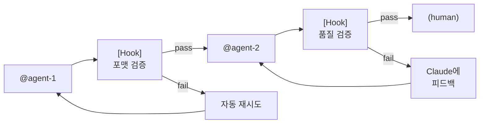

**품질 근거:** 결정론적 검증으로 반복 가능한 품질 기준을 자동 적용한다.

**적합한 경우:**
- 코드 품질, 보안 검증, 산출물 표준 준수가 중요
- 사람이 매번 확인하기에는 반복적인 검증 항목

### Pattern 5: Team + Hook 결합 (고급 하이브리드)

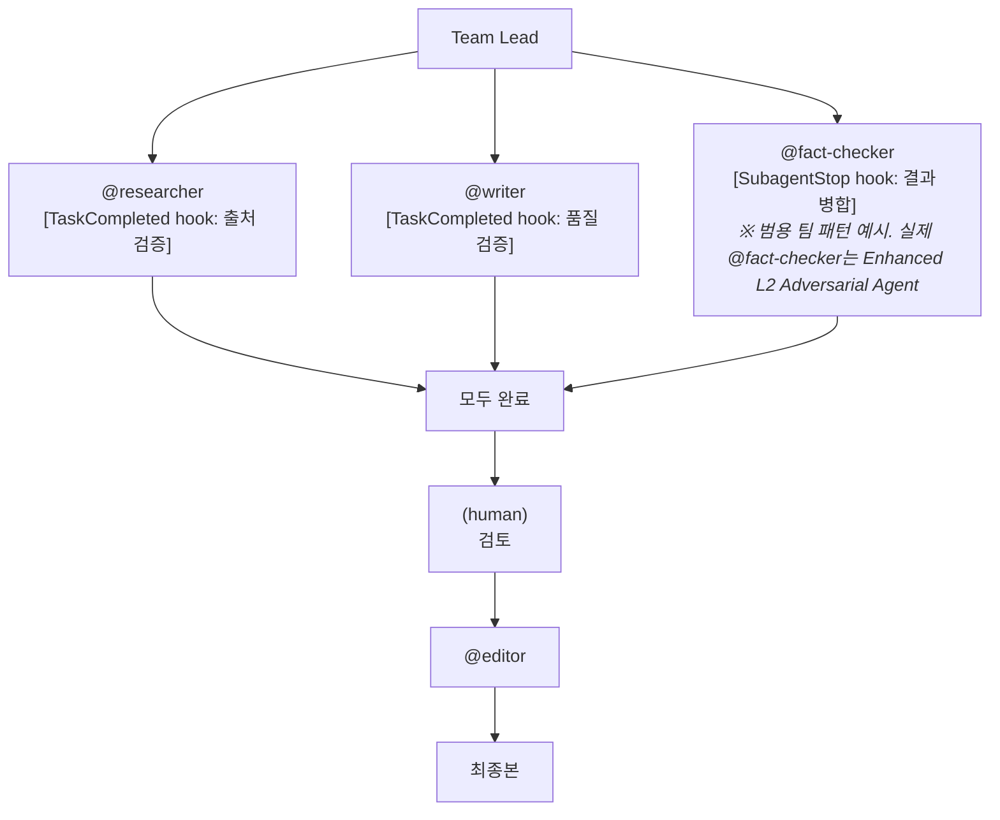

**품질 근거:** 병렬 전문가 작업 + 자동 품질 게이트 + 사람 검토의 3중 품질 보장이다.

**적합한 경우:**
- 복잡한 워크플로우에서 최고 수준의 품질이 요구될 때
- 각 전문가의 산출물에 독립적인 품질 기준이 있을 때

### Autopilot Mode (자동 승인 실행 모드)

위의 5가지 패턴 어디에든 적용 가능한 **실행 모드**이다. Autopilot 활성 시 `(human)` 단계가 자동 승인된다.

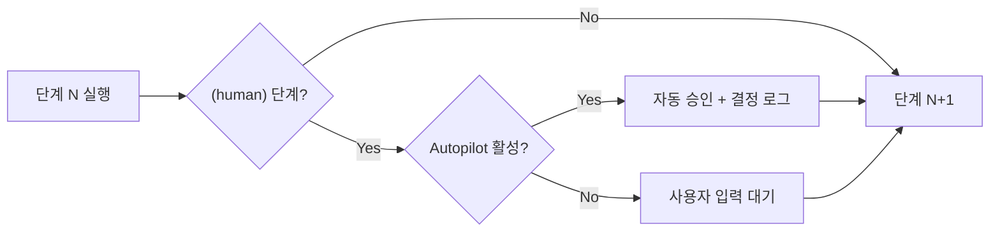

**핵심 제약:** `(hook)` 품질 게이트는 Autopilot에서도 그대로 차단. 모든 단계 완전 실행. 모든 산출물 완전 품질.

**Anti-Skip Guard + Verification Gate + pACS + Adversarial Review (4계층 품질 보장):**

각 단계 완료 시 Orchestrator가 수행하는 최대 4계층 검증:

```
L0: Anti-Skip Guard (결정론적)
  1. 산출물 파일이 SOT outputs에 경로로 기록되었는가
  2. 해당 파일이 디스크에 존재하는가
  3. 파일 크기가 최소 100 bytes 이상인가

L1: Verification Gate (의미론적 — Verification 필드 있는 단계만)
  4. 산출물이 Verification 기준을 100% 달성했는가
  5. 실패 기준 있으면 해당 부분만 재실행 (최대 10회)
  6. verification-logs/step-N-verify.md에 기록

L1.5: pACS Self-Rating (신뢰도 — Verification 통과 후)
  7. Pre-mortem Protocol → F/C/L 3차원 채점 → pACS = min(F,C,L)
  8. pacs-logs/step-N-pacs.md에 기록

L2: Adversarial Review (Enhanced — Review: 필드 지정 단계만)
  9. @reviewer/@fact-checker가 독립적 적대적 검토
  10. P1 검증(validate_review.py)으로 리뷰 품질 보장
  11. review-logs/step-N-review.md에 기록
```

> `Verification` 필드가 없는 단계는 L0(Anti-Skip Guard)만으로 진행 (하위 호환). 상세: §5.6, AGENTS.md §5.3~§5.5
>
> **Abductive Diagnosis Layer**: 품질 게이트(Verification/pACS/Review) FAIL → 재시도 사이에 3단계 구조화된 진단을 수행한다. Step A: P1 사전 증거 수집(`diagnose_context.py` — retry history, upstream evidence, hypothesis priority, fast-path 판정), Step B: LLM 원인 분석(가설 ≥ 2개 비교), Step C: P1 사후 검증(`validate_diagnosis.py` AD1-AD10 구조적 무결성). Fast-Path(FP1: 단순 누락, FP2: 기존 해결 패턴, FP3: 반복 실패 → 에스컬레이션)로 결정론적 단축 가능. 진단 로그는 `diagnosis-logs/step-N-{gate}-{timestamp}.md`에 기록되고, Knowledge Archive에 `diagnosis_patterns`로 아카이빙된다. 상세: AGENTS.md §5.6

**Decision Log:**

자동 승인된 결정은 `autopilot-logs/step-N-decision.md`에 기록 (투명성 보장):
- 필수 필드: step_number, checkpoint_type, decision, rationale, timestamp
- 표준 템플릿: `.claude/skills/workflow-generator/references/autopilot-decision-template.md`

**런타임 강화 아키텍처 (Claude Code 구현):**

Autopilot의 설계 의도를 런타임에서 강화하는 하이브리드(Hook + 프롬프트) 시스템:

```
                  ┌─── Hook 계층 (결정론적) ───┐
                  │                            │
SessionStart ─────→ Autopilot 실행 규칙 주입    │  ← 세션 경계마다 규칙 재주입
                  │ + 이전 단계 산출물 검증 결과  │
                  │                            │
Stop ─────────────→ Decision Log 누락 감지·보완  │  ← 자동 승인 패턴 regex 감지
                  │                            │
Snapshot ─────────→ Autopilot 상태 IMMORTAL 보존 │  ← 세션 경계에서 유실 방지
                  │                            │
PostToolUse ──────→ autopilot_step 진행 추적     │  ← work_log.jsonl 기록
                  └────────────────────────────┘

                  ┌─── 프롬프트 계층 (행동 유도) ─┐
                  │                             │
                  │  autopilot-execution.md Checklist│
                  │  각 단계 시작/실행/완료 필수 행동 │
                  └─────────────────────────────┘
```

> **SOT 준수**: Hook 계층은 SOT(`state.yaml`)를 읽기 전용으로만 접근한다. 쓰기는 `context-snapshots/`와 `autopilot-logs/`에만 수행 (절대 기준 2 준수).

상세: `AGENTS.md §5.1`

### ULW Mode (철저함 강도 오버레이)

ULW는 Autopilot과 **직교하는 철저함 강도(thoroughness intensity) 오버레이**이다.

**2x2 매트릭스:**

|  | **ULW OFF** | **ULW ON** |
|---|---|---|
| **Autopilot OFF** | 표준 대화형 | 대화형 + Sisyphus Persistence(3회) + 필수 태스크 분해 |
| **Autopilot ON** | 표준 자동 워크플로우 | 자동 워크플로우 + Sisyphus 강화(재시도 3회) |

**2축 비교:**

| 축 | 관심사 | 활성화 | 비활성화 |
|----|--------|--------|---------|
| **Autopilot** | 자동화(HOW) | SOT `autopilot.enabled: true` | SOT 변경 |
| **ULW** | 철저함(HOW THOROUGHLY) | 프롬프트에 `ulw` | 암묵적 (새 세션 시) |

**3가지 강화 규칙 (Intensifiers):**
1. **I-1. Sisyphus Persistence** — 최대 3회 재시도, 각 시도는 다른 접근법
2. **I-2. Mandatory Task Decomposition** — TaskCreate → TaskUpdate → TaskList 필수
3. **I-3. Bounded Retry Escalation** — 동일 대상 3회 초과 재시도 금지(품질 게이트는 별도 예산 적용)

**결정론적 강화 (Claude Code 구현):**

```
                  ┌─── Hook 계층 (결정론적) ───┐
                  │                            │
detect_ulw_mode ──→ 트랜스크립트 정규식 감지     │  ← word-boundary 오탐 방지
                  │                            │
Snapshot ─────────→ ULW 상태 IMMORTAL 보존      │  ← 세션 경계에서 유실 방지
                  │                            │
SessionStart ─────→ ULW 강화 규칙 주입          │  ← clear/compact/resume 시
                  │ (startup 제외 — 암묵적 해제) │
                  │                            │
Stop ─────────────→ Compliance Guard 검증       │  ← 3개 강화 규칙 결정론적 체크
                  │ + ULW 안전망 (stderr 경고)  │
                  │ + Knowledge Archive 태깅    │
                  └────────────────────────────┘
```

> **Autopilot과의 결합**: ULW는 Autopilot을 **강화**한다 — 품질 게이트 재시도 한도 10→15회 상향. Safety Hook 차단은 항상 존중.

상세: `docs/protocols/ulw-mode.md`

---

## 7. 문서 아키텍처 (Documentation Architecture)

### 7.1 파일 간 역할 분담 설계

이 프로젝트의 문서 체계는 **의도적으로 설계된 계층 구조**를 따른다:

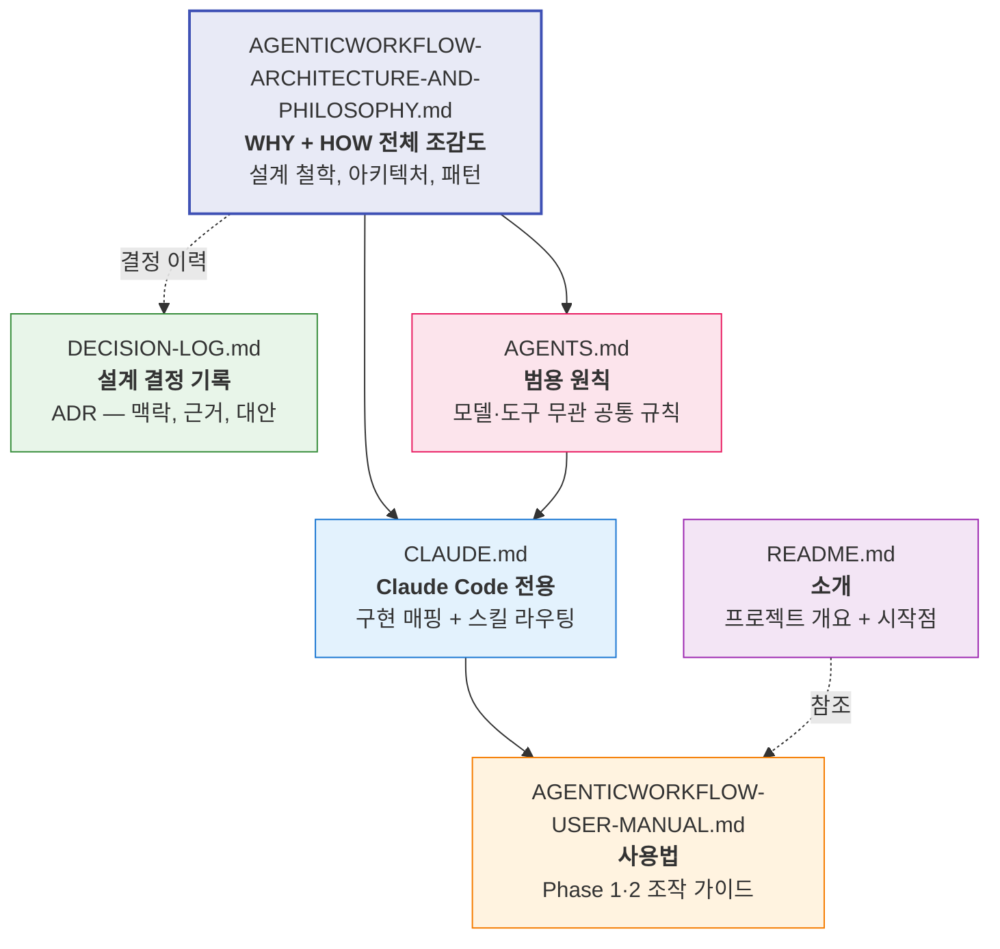

**각 파일의 역할:**

| 파일 | 대상 독자 | 답하는 질문 | 참조 빈도 |
|------|---------|-----------|----------|
| **ARCHITECTURE** | 설계자, 신규 기여자 | "왜 이렇게 설계했는가?" | 초기 이해 시 |
| **DECISION-LOG** | 설계자, 미래 의사결정자 | "언제, 왜 그 결정을 했는가?" | 결정 추적 시 |
| **AGENTS.md** | 모든 AI 에이전트 | "모델·도구와 무관하게 따라야 할 규칙은?" | 매 세션 |
| **CLAUDE.md** | Claude Code | "Claude Code 고유 기능으로 어떻게 구현하는가?" | 매 세션 |
| **USER-MANUAL** | 사용자 (사람) | "이 도구를 어떻게 쓰는가?" | 필요 시 |
| **README.md** | 첫 방문자 | "이 프로젝트가 뭔가?" | 최초 1회 |

**Hub-and-Spoke 시스템 프롬프트 체계:**

이 프로젝트는 **어떤 AI CLI 도구를 사용하든** 동일한 방법론이 자동으로 적용되도록 설계되었다. `AGENTS.md`가 방법론의 SOT(Hub)이고, 각 도구별 파일이 Spoke 역할을 한다:

```
                AGENTS.md (Hub — 방법론 SOT)
               /    |    |    \    \     \
          CLAUDE  GEMINI .cursor  .github/
          .md     .md    /rules   copilot-
                         (Spoke)  instructions.md
```

| AI CLI 도구 | Spoke 파일 | 자동 읽기 |
|------------|-----------|----------|
| Claude Code | `CLAUDE.md` | Yes |
| Gemini CLI | `GEMINI.md` (+ `@AGENTS.md` import) | Yes |
| Codex CLI | `AGENTS.md` 직접 | Yes |
| Copilot CLI | `.github/copilot-instructions.md` | Yes |
| Cursor | `.cursor/rules/agenticworkflow.mdc` | Yes (alwaysApply) |

각 Spoke 파일은 두 가지 역할을 한다:
1. **절대 기준 인라인 + 상세 참조**: 핵심 정의를 인라인으로 포함하고, 상세는 AGENTS.md 참조
2. **도구별 구현 매핑**: 해당 도구의 고유 기능과 AgenticWorkflow 개념의 대응

**AGENTS.md와 Spoke 파일의 관계:**

모든 Spoke 파일의 절대 기준과 설계 원칙은 AGENTS.md와 **동일**하다. 차이는 구현 매핑의 구체성뿐이다:

| 구분 | AGENTS.md (Hub) | CLAUDE.md (Spoke 예시) |
|------|----------------|----------------------|
| 절대 기준 | 원본 정의 | 인라인 복제 + 참조 |
| 설계 원칙 P1-P4 | 원본 정의 | 인라인 복제 + 참조 |
| 구현 요소 명칭 | "전문 에이전트", "에이전트 그룹", "자동 검증" | "Sub-agent", "Agent Team", "Hooks" |
| 설정 예시 | 없음 (도구 중립) | `.claude/agents/*.md`, `.claude/settings.json` |
| 컨텍스트 보존 | 원칙만 정의 | Hook 기반 자동 시스템 (Claude Code 전용) |

> **충돌 시:** AGENTS.md의 절대 기준이 모든 Spoke보다 우선한다. 도구 종속적 구현보다 원칙이 상위이다.
> **동기화 의무:** AGENTS.md의 절대 기준이 변경되면 모든 Spoke의 인라인 복제도 업데이트해야 한다.

### 7.2 스킬 내부 아키텍처: WHY/WHAT/HOW/VERIFY 체계

모든 스킬은 **파일 간 역할 분담**이라는 설계 패턴을 따른다. 이것은 우연이 아닌 **의도적 설계**이다:

```
SKILL.md (WHY — 이 스킬이 왜 존재하는가)
  ├── 절대 기준의 도메인 맥락화
  ├── 핵심 원칙과 판단 기준
  └── 워크플로우 (어떤 순서로 적용하는가)

references/ (WHAT/HOW/WHERE/VERIFY)
  ├── WHAT — 무엇을 다루는가 (문제 카탈로그, 분석 체크리스트)
  ├── HOW — 어떻게 해결하는가 (구현 패턴, 수정 사례)
  ├── WHERE — 어디에 적용하는가 (분야별 가이드, 언어별 가이드)
  └── VERIFY — 어떻게 검증하는가 (체크리스트, 평가 기준)
```

**workflow-generator의 역할 분담:**

| 파일 | 역할 | 사용 시점 |
|------|------|----------|
| `SKILL.md` | **WHY** — 스킬의 존재 이유, 케이스 분기, 절대 기준 | 매 실행 시 진입점 |
| `workflow-template.md` | **WHAT** — workflow.md의 표준 구조 + 표기법 | Phase 1: 워크플로우 생성 |
| `claude-code-patterns.md` | **HOW** — Sub-agent, Team, Hook 구현 패턴 | Phase 2: 구현 설계 |
| `document-analysis-guide.md` | **WHAT** — 문서 분석 체크리스트 (6대 추출 범주) | Phase 1 Case 2: 문서 분석 |
| `context-injection-patterns.md` | **HOW** — 컨텍스트 주입 패턴 가이드 | Phase 2: 에이전트 프롬프트 설계 |
| `autopilot-decision-template.md` | **VERIFY** — Autopilot Decision Log 표준 템플릿 | Autopilot 모드 실행 시 결정 기록 |
| `state.yaml.example` | **WHAT** — SOT 파일 구조 예시 + 필드 설명 | Phase 2: SOT 초기화 |

**doctoral-writing의 역할 분담:**

| 파일 | 역할 | 사용 시점 |
|------|------|----------|
| `SKILL.md` | **WHY** — 4대 원칙, 절대 기준, 5단계 워크플로우 | 매 실행 시 진입점 |
| `common-issues.md` | **WHAT** — 10종 문제 카탈로그 + Before/After | 패턴 식별 |
| `before-after-examples.md` | **HOW** — 실제 학위논문 수정 사례 | 구체적 수정 예시 필요 시 |
| `korean-quick-reference.md` | **HOW (Korean)** — 한국어 논문 패턴 라이브러리 | 한국어 작성 시 |
| `discipline-guides.md` | **WHERE** — 인문/사회/자연과학별 관례 | 분야별 질문 시 |
| `clarity-checklist.md` | **VERIFY** — 체계적 명료성·간결성·엄밀성 평가 | 수정 후 검증 |

### 7.3 의도적 중복의 원칙

일부 개념(예: 능동태 vs 수동태, 문장 길이 규칙)이 여러 파일에 등장한다. 이것은 설계 결함이 아닌 **의도적 중복**이다:

| 같은 개념의 다른 표현 | 접근 패턴 | 독자의 니즈 |
|-------------------|----------|-----------|
| SKILL.md의 "능동태 선호 원칙" | 원칙 학습 | "왜 능동태를 선호하는가?" |
| common-issues.md의 "수동태 과용 문제 + Before/After" | 문제 해결 | "내 문장의 수동태를 어떻게 고치는가?" |
| clarity-checklist.md의 "능동태/수동태 체크 항목" | 검증 | "이 문장이 적절한 태를 사용하는가?" |
| discipline-guides.md의 "자연과학 methods 섹션 수동태 관례" | 예외 판단 | "이 분야에서는 수동태가 관례인가?" |

**설계 철학:** 동일한 지식이라도, 접근 목적(학습 / 해결 / 검증 / 예외 판단)이 다르면 **다른 형태로 표현되어야** 한다. 이것은 단순 중복이 아닌 **다면적 접근을 위한 의도적 복제**이다.

---

## 8. 프롬프트 자원 체계 (Prompt Resource Architecture)

`prompt/` 디렉터리의 3개 파일은 각각 다른 Phase, 다른 목적에서 사용되는 독립적 자원이다:

### 8.1 자원별 역할과 사용 시점

| 자원 | 역할 | Phase | 사용 시점 |
|------|------|-------|----------|
| `crystalize-prompt.md` | 프롬프트 압축 | Phase 2 | Sub-agent 프롬프트가 과도하게 길어질 때 |
| `distill-partner.md` | 에센스 추출 인터뷰 | Phase 1 (Distill 검증) | 생성된 workflow.md의 품질 검증 |
| `crawling-skill-sample.md` | 방어적 크롤링 스킬 샘플 | Phase 2 | 새로운 스킬 파일 작성 시 구조 참조 |

### 8.2 crystalize-prompt: 에이전트 명령어 압축

장문의 AI 에이전트 지시문을 의미 손실 없이 압축하는 메타 프롬프트이다.

**5대 압축 원칙:**
1. **의도 보존(Intent Preservation)**: 각 지시의 WHY를 유지
2. **고해상도 토큰화(High-Resolution Tokenization)**: 장문 설명 → 도메인 특정 개념 참조로 대체
3. **암묵적 지식 활용(Implicit Knowledge Leverage)**: LLM의 기존 지식을 시그널로 활성화
4. **조건부 구조(Conditional Deployment)**: `[조건] → [행동]` 패턴
5. **중복 제거(Deduplication)**: 동일 의도의 다른 표현 통합

**AgenticWorkflow에서의 역할:** Agent Team에서 다수의 에이전트가 각각의 프롬프트를 가질 때, 토큰 효율을 높이면서 지시의 정밀도를 유지하는 도구이다.

### 8.3 distill-partner: 범위 축소 + 자동화 발견

4단계 인터뷰 프레임워크로 작업의 핵심을 추출한다:

```
Step 1: 맥락 파악
Step 2: "절대 필수인 것은?"  → 핵심 개념 (유지)
Step 3: "제외할 수 있는 것은?" → 제거 대상 (제거)
Step 4: "반복·자동화 가능한 것은?" → 자동화 기회 (스크립트화)
```

**AgenticWorkflow에서의 역할:** 생성된 workflow.md에 대해 "이 단계가 품질에 기여하는가?", "자동화하면 안정성이 높아지는가?", "빠진 품질 향상 단계가 있는가?"를 검증하는 **Distill 검증** 도구이다. 절대 기준 1(품질 극대화)의 후처리 검증에 해당한다.

### 8.4 crawling-skill-sample: 방어적 에이전트-도구 상호작용

네이버 뉴스 크롤링을 위한 방어적 크롤링 프레임워크이다. 단순 참고용이 아닌 **스킬 파일의 구조적 참조**로 기능한다:

- **전략 에스컬레이션 패턴**: default → header rotation → delay increase → proxy rotation → browser emulation
- **관찰 가능성(Observability)**: 차단 유형과 성공 패턴의 로깅
- **우아한 저하(Graceful Degradation)**: 전략 실패 시 다음 전략으로 자동 전환

이 패턴은 에이전트 워크플로우의 **에러 처리 설계**에도 적용 가능하다: 에이전트 실패 → 재시도 → 대안 에이전트 → 사람 개입.

---

## 9. 표기법 체계 (Notation System)

workflow.md에서 사용하는 표기법은 6가지로 구성된다. 이 표기법은 단순한 마크다운 컨벤션이 아닌, **워크플로우의 실행 의미론(execution semantics)을 담은 설계 언어**이다.

| 표기 | 의미 | 실행 의미론 | 구현 매핑 |
|------|------|-----------|----------|
| `(human)` | 사람의 개입/검토 필요 | 자동 일시정지, 사용자 입력 대기 | Slash Command로 resume |
| `(team)` | Agent Team 병렬 실행 구간 | 팀 생성, 병렬 작업 분배, Join | TeamCreate + TaskCreate |
| `(hook)` | 자동 검증/품질 게이트 | exit code로 통과/차단 결정 | settings.json Hook 설정 |
| `@agent-name` | Sub-agent 호출 | 독립 세션에서 전문 작업 수행 | `.claude/agents/*.md` |
| `/command-name` | Slash command 실행 | 사용자 인터랙션 트리거 | `.claude/commands/*.md` |
| `[skill-name]` | Skill 참조 | 도메인 지식 패키지 주입 | `.claude/skills/*/SKILL.md` |

**표기법의 설계 의도:**

각 표기는 **읽기만으로 실행 모델을 파악**할 수 있도록 설계되었다:

```markdown
### 2. (team) 병렬 리서치
- **Tasks**:
  - `@researcher`: 웹 소스에서 최신 트렌드 수집
  - `@data-processor`: 기존 데이터 정리 및 통계 분석
- **Join**: 모든 팀원 완료 후 Step 3으로
```

이 한 단락에서 다음을 읽을 수 있다:
- `(team)` → 병렬 실행, 독립 세션
- `@researcher`, `@data-processor` → 각각의 Sub-agent 정의 필요
- **Join** → 모든 팀원 완료 시 합류 조건

---

## 10. 확장 설계 (Extension Points)

### 10.1 새 스킬 추가 시 필수 요건

스킬 개발 규칙은 **4가지 의무 사항**으로 구성된다:

| # | 의무 사항 | 근거 |
|---|---------|------|
| 1 | **모든 절대 기준을 반드시 포함** — 해당 도메인에 맞게 맥락화 (코드 변경이 아닌 도메인은 절대 기준 3 N/A 가능) | 스킬이 프로젝트의 가치 체계와 정렬되어야 함 |
| 2 | **파일 간 역할 분담** — SKILL.md(WHY), references/(WHAT/HOW/VERIFY) | WHY/WHAT/HOW/VERIFY 체계의 일관성 유지 |
| 3 | **절대 기준 간 충돌 시나리오를 구체적으로 명시** | 추상적 규칙이 아닌 실전 판단 기준이어야 효과적 |
| 4 | **수정 후 반드시 성찰** | 문구만 넣지 않고, 기존 내용과의 충돌 여부를 실제로 점검 |

**새 스킬 디렉터리 구조:**

```
.claude/skills/[skill-name]/
├── SKILL.md                    ← WHY (진입점)
│   ├── 절대 기준 도메인 맥락화
│   ├── 핵심 원칙
│   ├── 충돌 시나리오
│   └── 워크플로우 (적용 순서)
└── references/                 ← WHAT/HOW/VERIFY
    ├── [what-file].md          ← 문제/개념 카탈로그
    ├── [how-file].md           ← 구현 패턴/수정 사례
    └── [verify-file].md        ← 검증 체크리스트
```

### 10.2 새 에이전트 추가 시 모델 선택 기준

| 질문 | 답변에 따른 선택 |
|------|----------------|
| "이 작업에서 최고 수준의 추론이 필요한가?" | Yes → `opus` |
| "안정적이고 반복적인 작업인가?" | Yes → `sonnet` |
| "단순 판단, 상태 확인 수준인가?" | Yes → `haiku` |
| "비용이 선택 기준인가?" | **아니오.** 품질이 유일한 기준 (절대 기준 1) |

### 10.3 Hook 설계 시 규칙

**차단 가능한 이벤트** (exit code 2로 동작 중단 가능):
- `PreToolUse`, `Stop`, `UserPromptSubmit`, `SubagentStop`, `TeammateIdle`, `TaskCompleted`

**차단 불가 이벤트** (로깅/자동화만 가능):
- `SessionStart`, `PostToolUse`, `SubagentStart`, `PreCompact`

**Hook 설계 체크리스트:**
1. 이 검증은 결정론적으로 가능한가? → `command` 타입
2. LLM의 1회 판단이 필요한가? → `prompt` 타입
3. 복잡한 다단계 검증이 필요한가? → `agent` 타입
4. exit code 2 차단 시 사용자에게 명확한 피드백을 제공하는가?
5. 비차단 실패 시 로그가 충분히 기록되는가?

### 10.4 에러 처리 패턴

```yaml
error_handling:
  on_agent_failure:
    action: retry
    max_attempts: 3

  on_tool_failure:
    action: notify_and_pause
    message: "도구 실행 실패. 수동 개입 필요."

  on_validation_failure:
    action: rollback_to_step
    step: previous

  on_verification_failure:
    action: retry_failed_criteria
    max_retries: 2
    escalation: user
    log: "verification-logs/step-N-verify.md"

  on_hook_failure:
    action: log_and_continue
    message: "Hook 실행 실패. 워크플로우는 계속 진행."

  on_context_overflow:
    action: save_and_recover
    description: "컨텍스트 초과 시 Context Preservation System이 자동 저장. 새 세션에서 SOT + 스냅샷 기반 복구"
```

이 패턴은 `crawling-skill-sample.md`의 전략 에스컬레이션 패턴과 구조적으로 동일하다: 실패 → 재시도 → 대안 → 사람 개입.

---

## 11. Doctoral Thesis Workflow Architecture

### 11.1 개요

AgenticWorkflow의 DNA 유전 철학(§1.4)을 실증하는 최초의 대규모 자식 시스템이다. 210-step 박사 논문 연구 시뮬레이션으로, 부모의 전체 게놈(절대 기준, SOT, 4계층 QA, Safety Hook)이 논문 도메인에 맞게 발현된다.

### 11.2 Phase/Wave/Gate/HITL 구조

```
Phase 0: Initialization + Topic Exploration  (Step 1-38)    ── HITL-0/1 ──▶
Phase 1: Literature Review                   (Step 39-104)
├── Wave 1: Basic Search         (Step 39-54)   ── Gate-1 ──▶
├── Wave 2: Deep Analysis        (Step 55-70)   ── Gate-2 ──▶
├── Wave 3: Critical Analysis    (Step 71-86)   ── Gate-3 ──▶
├── Wave 4: Integrated Synthesis (Step 87-94)   ── Gate-4 ──▶
├── Wave 5: Quality Assurance    (Step 95-98)   ── SRCS-Full ──▶
└── HITL-2: Literature Review Approval          (Step 99-104)
Phase 2: Research Design                     (Step 105-132) ── HITL-3/4 ──▶
Phase 3: Thesis Writing                      (Step 133-168) ── HITL-5/6/7 ──▶
Phase 4: Publication Strategy                (Step 169-180) ── HITL-8 ──▶
Translation: Korean Translation              (Step 181-210)
```

- **Gate**: Wave 간 교차 검증. 이전 Wave의 claim 품질이 임계값 미달 시 진행 차단.
- **HITL**: 인간 승인 필수 지점. 연구 방향, 방법론, 최종 산출물의 인간 검토.
- **3-tier Fallback**: Team → Sub-agent → Direct 실행. 상위 tier 실패 시 자동 강등.

### 11.3 논문 SOT (`session.json`)

시스템 SOT(`state.yaml`)와 독립된 논문 전용 상태 파일:

| 필드 | 설명 |
|------|------|
| `current_step` | 현재 진행 step (0-210) |
| `total_steps` | 전체 step 수 (210) |
| `status` | running / completed / error / paused |
| `gates` | 5개 Gate 상태 (pending/pass/fail) |
| `hitl_checkpoints` | 9개 HITL 상태 (pending/completed/blocked) |
| `outputs` | step별 산출물 경로 |
| `fallback_history` | Fallback 이벤트 이력 |
| `context_snapshots` | 체크포인트 이력 |

**Dependency Groups (DEPENDENCY_GROUPS)**:

17개 의존성 그룹이 Gate/HITL 전제 조건을 관리한다. 이 그룹은 체크리스트 섹션(19개)과 1:1 대응하지 않으며, 동일한 전제 조건(gate/hitl/phase)을 공유하는 step 범위를 묶는다:

| Group | Steps | 전제 조건 |
|-------|-------|----------|
| `phase-0` | 1-8 | — |
| `phase-0-A` | 9-14 | — |
| `phase-0-D` | 15-34 | — |
| `hitl-1` | 35-38 | — |
| `wave-1` | 39-54 | — |
| `wave-2` | 55-70 | gate-1 + wave-1 |
| `wave-3` | 71-86 | gate-2 + wave-2 |
| `wave-4` | 87-94 | gate-3 + wave-3 |
| `wave-5` | 95-98 | srcs-full + wave-4 |
| `hitl-2` | 99-104 | — |
| `phase-2` | 105-124 | hitl-2 |
| `hitl-3-4` | 125-132 | — |
| `phase-3` | 133-156 | hitl-3-4 |
| `hitl-5-6-7` | 157-168 | — |
| `phase-4` | 169-176 | hitl-5-6-7 |
| `hitl-8` | 177-180 | — |
| `translation` | 181-210 | hitl-8 |

### 11.4 에이전트 아키텍처 (52 agents (4 base + 48 thesis))

| 역할 | 에이전트 예시 | Phase |
|------|------------|-------|
| 문헌 검색·분석 | topic-explorer, deep-analyzer, synthesis-builder | Phase 0 |
| 연구 설계 | methodology-architect, sampling-designer | Phase 1 |
| 집필·편집 | chapter-writer, academic-editor | Phase 2 |
| 품질 검증 | cross-validator, plagiarism-checker, srcs-evaluator | 전 Phase |

모든 에이전트는 GroundedClaim 스키마(`id, text, claim_type, sources[], confidence, verification`)를 사용하여 claim을 생성하며, 47개 고유 prefix로 출처를 추적한다.

### 11.5 핵심 인프라 스크립트

| 스크립트 | 역할 |
|---------|------|
| `checklist_manager.py` | 논문 SOT CRUD — init, advance, gate, HITL, checkpoint |
| `query_workflow.py` | 논문 관측성 — dashboard, weakest-step, blocked, retry |
| `validate_grounded_claim.py` | GroundedClaim ID 검증 (47개 prefix) |
| `fallback_controller.py` | 3-tier Fallback 제어 |
| `guard_sot_write.py` | 논문 SOT 쓰기 보호 (Edit\|Write 차단, fail-closed) |

---

## 부록: 용어 정리

| 용어 | 정의 |
|------|------|
| **SOT (Single Source of Truth)** | 모든 공유 상태를 집중시키는 단일 파일. 데이터 불일치를 방지하는 아키텍처 패턴 |
| **Orchestrator** | 워크플로우 전체를 조율하는 단일 제어점. SOT 쓰기 권한을 가진 유일한 에이전트 |
| **Sub-agent** | 단일 세션 내에서 컨텍스트를 위임받아 독립 작업을 수행하는 전문 에이전트 |
| **Agent Team (Swarm)** | 여러 독립 세션이 병렬로 협업하는 팀 기반 작업 시스템 |
| **Team Lead** | Agent Team에서 작업 분배와 SOT 쓰기를 담당하는 조율 에이전트 |
| **Teammate** | Agent Team 내에서 독립 세션으로 작업을 수행하는 팀원 에이전트 |
| **Hook** | 워크플로우 라이프사이클의 특정 시점에 자동 실행되는 결정론적 자동화 |
| **Slash Command** | 사용자 인터랙션을 구조화하는 명령어. 검토, 승인, 선택 등의 개입점을 정의 |
| **Skill** | 재사용 가능한 도메인 지식과 패턴을 캡슐화한 구조화된 지식 패키지 |
| **MCP (Model Context Protocol)** | 외부 서비스(API, DB 등)를 에이전트에 통합하는 프로토콜 |
| **Phase 1** | 워크플로우 설계 단계. workflow.md를 생성하는 과정 |
| **Phase 2** | 워크플로우 구현 단계. 에이전트·스크립트·자동화를 실제로 만드는 과정 |
| **RLM (Recursive Language Model)** | 프롬프트를 외부 환경의 객체로 취급하여 재귀적으로 분해하는 추론 패러다임 |
| **Pre-processing** | AI 에이전트에 데이터를 전달하기 전 수행하는 코드 기반 노이즈 제거 |
| **Post-processing** | 에이전트 산출물을 다음 단계로 전달하기 전 수행하는 정제 작업 |
| **Distill 검증** | distill-partner.md를 사용한 workflow.md의 선택적 품질 강화 인터뷰 |
| **WHY/WHAT/HOW/VERIFY** | 스킬 파일 역할 분담 체계. SKILL.md=WHY, references=WHAT/HOW/VERIFY |
| **AskUserQuestion** | 워크플로우 실행 중 동적으로 사용자에게 구조화된 질문을 하는 도구. P4 규칙 적용 |
| **Autopilot Mode** | 워크플로우 실행 시 사람 개입 지점을 자동 승인하는 실행 모드. 모든 단계는 완전히 실행하며 Hook 품질 게이트는 영향받지 않음 |
| **Anti-Skip Guard** | Autopilot에서 단계 건너뛰기를 방지하는 결정론적 검증. 산출물 파일 존재 + 최소 크기(100 bytes) 확인 |
| **Decision Log** | Autopilot이 자동 승인한 결정의 투명성을 보장하는 기록. `autopilot-logs/step-N-decision.md` 형식 |
| **Task System** | Agent Team에서 작업 할당·추적·의존성 관리를 위한 내장 도구 (TaskCreate/TaskUpdate/TaskList). SOT를 대체하지 않음 |
| **Verification Protocol** | 워크플로우 각 단계의 산출물이 기능적 목표를 100% 달성했는지 검증하는 에이전트 실행 프로토콜. AGENTS.md §5.3에 정의 |
| **Verification Gate** | Anti-Skip Guard(물리적) 위에 동작하는 의미론적 검증 계층. 에이전트가 산출물을 Verification 기준 대비 자기 검증 수행. 실패 시 최대 10회 재실행 |
| **Verification Log** | Verification Gate 통과 기록. `verification-logs/step-N-verify.md` 형식. 기준별 PASS/FAIL + Evidence 포함 |
| **pACS (predicted Agent Confidence Score)** | Verification Gate 통과 후 에이전트가 F(Factual Grounding)/C(Completeness)/L(Logical Coherence) 3차원으로 자기 평가. pACS = min(F,C,L). GREEN(≥70)/YELLOW(50-69)/RED(<50) |
| **E5 Guard (Empty Snapshot Guard)** | 다중 신호 감지(크기 ≥3KB OR ≥2개 섹션 마커)로 풍부한 latest.md가 빈 스냅샷에 덮어쓰이는 것을 방지하는 보호 메커니즘 |
| **Knowledge Archive** | `knowledge-index.jsonl` + `sessions/`로 세션 간 지식을 축적하는 구조화된 인덱스 시스템. RLM 프로그래밍적 탐색 대상 |
| **Error Taxonomy** | 도구 에러를 12개 패턴으로 결정론적 분류하는 체계. Error→Resolution 매칭으로 해결 패턴도 기록 |
| **Predictive Debugging** | Error Taxonomy 데이터를 사전 예측에 활용하는 L-1 계층. `aggregate_risk_scores()`(집계) + `predictive_debug_guard.py`(PreToolUse 경고) + RS1-RS6 P1 검증. ADR-036 |
| **IMMORTAL Section** | 스냅샷 압축 시 우선 보존되는 핵심 섹션. 사용자 작업 지시, Autopilot/ULW 상태 등을 포함 |
| **ULW (Ultrawork) Mode** | Autopilot과 직교하는 철저함 강도 오버레이. 3가지 강화 규칙(Intensifiers): Sisyphus Persistence(3회 재시도) + Mandatory Task Decomposition + Bounded Retry Escalation. 프롬프트에 `ulw` 포함 시 활성화 |
| **P1 Hallucination Prevention** | 반복 정확 작업(스키마 검증, 쓰기 패턴 검증 등)을 Python 코드로 강제하여 AI 할루시네이션을 봉쇄하는 메커니즘 |
